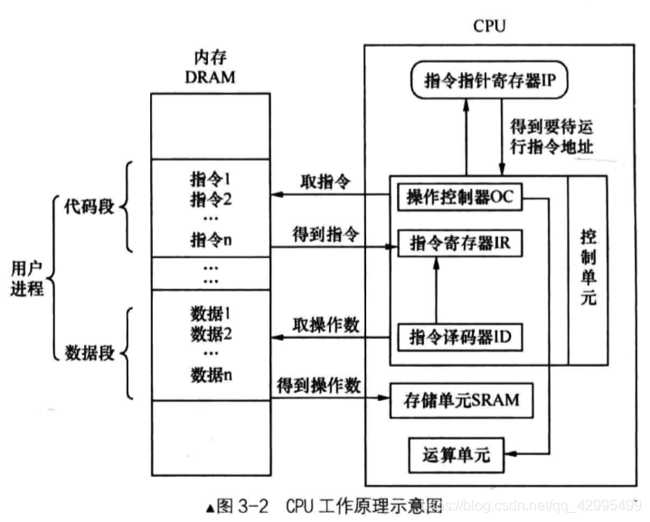

## 写一个 MBR 程序

我们先来贴出程序，然后再来解释。如下这段代码的功能是在屏幕上打印字符串 "1 MBR"。背景色为黑色，前景色为绿色。

```
;主引导程序 
;------------------------------------------------------------
SECTION MBR vstart=0x7c00         
   mov ax,cs      
   mov ds,ax
   mov es,ax
   mov ss,ax
   mov fs,ax
   mov sp,0x7c00

; 清屏 利用0x06号功能，上卷全部行，则可清屏。
; -----------------------------------------------------------
;INT 0x10   功能号:0x06	   功能描述:上卷窗口
;------------------------------------------------------
;输入：
;AH 功能号= 0x06
;AL = 上卷的行数(如果为0,表示全部)
;BH = 上卷行属性
;(CL,CH) = 窗口左上角的(X,Y)位置
;(DL,DH) = 窗口右下角的(X,Y)位置
;无返回值：
   mov     ax, 0x600
   mov     bx, 0x700
   mov     cx, 0           ; 左上角: (0, 0)
   mov     dx, 0x184f	   ; 右下角: (80,25),
			   ; VGA文本模式中,一行只能容纳80个字符,共25行。
			   ; 下标从0开始,所以0x18=24,0x4f=79
   int     0x10            ; int 0x10

;;;;;;;;;    下面这三行代码是获取光标位置    ;;;;;;;;;
;.get_cursor获取当前光标位置,在光标位置处打印字符.
   mov ah, 3		; 输入: 3号子功能是获取光标位置,需要存入ah寄存器
   mov bh, 0		; bh寄存器存储的是待获取光标的页号

   int 0x10		; 输出: ch=光标开始行,cl=光标结束行
							; dh=光标所在行号,dl=光标所在列号

;;;;;;;;;    获取光标位置结束    ;;;;;;;;;;;;;;;;

;;;;;;;;;     打印字符串    ;;;;;;;;;;;
   ;还是用10h中断,不过这次是调用13号子功能打印字符串
   mov ax, message 
   mov bp, ax		; es:bp 为串首地址, es此时同cs一致，
								; 开头时已经为sreg初始化

   ; 光标位置要用到dx寄存器中内容,cx中的光标位置可忽略
   mov cx, 5			; cx 为串长度,不包括结束符0的字符个数
   mov ax, 0x1301	; 子功能号13是显示字符及属性,要存入ah寄存器,
									; al设置写字符方式 ah=01: 显示字符串,光标跟随移动
   mov bx, 0x2		; bh存储要显示的页号,此处是第0页,
									; bl中是字符属性, 属性黑底绿字(bl = 02h)
   int 0x10				; 执行BIOS 0x10 号中断
;;;;;;;;;      打字字符串结束	 ;;;;;;;;;;;;;;;

   jmp $		; 使程序悬停在此

   message db "1 MBR"
   times 510-($-$$) db 0
   db 0x55,0xaa
```

#### 1. section 相关

section 是伪指令，是 nasm 提供的。CPU 运行程序是不需要这个东西的，section 只是用来给程序员规划程序用的，逻辑上划分成段的好处就是方便开发人员梳理代码，方便管理。

如果没有定义 section，nasm 默认全部代码同为一个 section，起始位置为 0。

`$` 表示本行代码的地址，`$$` 表示本 section 的起始地址。这两个都是 nasm 预留的关键字，是编译器安排的。 

`vstart=0x7c00` 表示在编译时，把起始地址编译为 `0x7c00`。

使用 nasm 进行编译这个汇编文件：`nasm -o mbr.bin mbr.s`

使用 `bin/bximage` 来创建一块虚拟硬盘。然后使用 `dd` 工具将 `mbr.bin` 写入这块硬盘中。

bximage 命令创建硬盘：`bximage -hd -mode="flat" -size=60 -q a.img`

如下是 dd 命令的选项

```
if=FILE  // 指定要读取的文件
of=FILE  // 指定要把数据输出到那个文件
bs=BYTES  // 指定块的大小，dd 是以块为单位来进行 IO 操作的。此项是统一配置了输入块大小 ibs 和输出块大小 obs 的值，也可以单独配置
count=BLOCKS  // 指定拷贝的块数
seek=BLOCKS  // 指定当我们把块输出到文件时想要跳过多少个块
conv=CONVS  // 指定如何转换文件，建议在追加数据时，conv 用 notrunc 方式，也就是不打断文件

dd if=/path/mbr.bin of=/path/a.img bs=512 count=1 conv=notrunc
```

`vstart=xxx` 和 `org xxx` 都是告诉编译器将程序编译到 xxx 地址。

cpu 的工作原理总结如下：

控制单元要取下一条待运行的指令，该指令的地址在程序计数器 PC 中，在 x86 CPU 上，程序计数器就是 `cs:ip`。于是读取 ip 寄存器后，将此地址送上地址总线，CPU 根据此地址便得到了指令，并将其存入到指令寄存器 IR 中。这时候轮到指令译码器，根据指令格式检查指令寄存器中的指令，先确定操作码是什么，再检查操作数类型，若是在内存中，就将相应操作数从内存中取回放入自己的存储单元，若操作数是在寄存器中就直接用了。此时，操作码有了，操作数也齐了，操作控制器给运算单元下令，开工，于是运算单元便真正开始执行指令了。ip 寄存器的值被加上当前指令的大小，于是 ip 又指向了下一条指令的地址。接着控制单元又要取下一条指令了，流程回到了本段开头，CPU 便开始了日复一日的循环，由于 CPU 特别不容易坏，所以唯一它停下来的条件就是断电。




