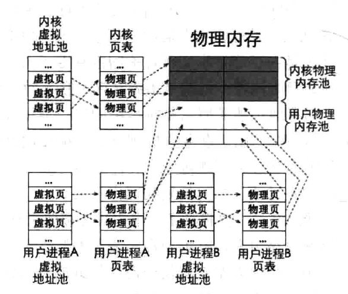
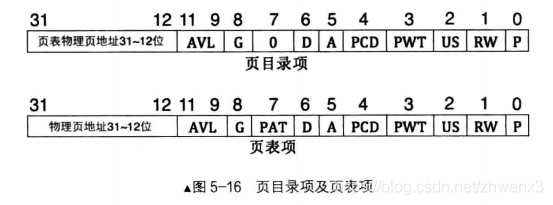
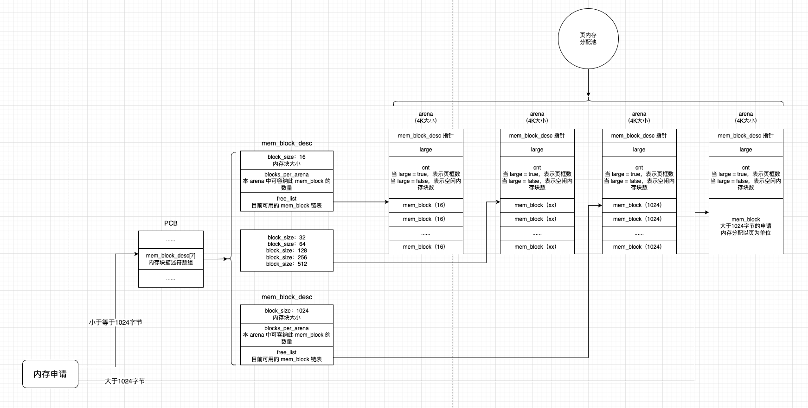

## 一、规划内存池

### 1. 物理内存池规划

内核和用户进程都要运行在物理内存中，我们将物理内存划分成两部分，一部分用来运行内核，一部分用来运行用户进程。操作系统为了能够正常运行，必须给自己预留出足够的内存才行，否则有可能会出现因为物理内存不足，导致内核自己都无法正常运行的情况。

因此我们把物理内存池分为：内核内存池、用户内存池。内存池中管理的是一个个大小为 4K 的内存块，从内存池中获取的内存大小至少为4KB 或者 4KB 的倍数。目前我们将内核内存池和用户内存池的大小设为一致，即各占一半的物理内存。

### 2. 虚拟内存池规划

我们回顾下分页机制：

- 分页机制下程序中的地址都是虚拟地址
- 虚拟地址的范围取决于地址总线的宽度，因此 32 位环境下，虚拟地址空间为 4GB
- 分页机制下，每个任务都有自己的 4GB 虚拟地址空间。不仅用户进程是这样，内核也是
- 程序中的地址是由链接器在链接过程中分配的，且分配之后就不会变了。运行时按部就班的送上处理器的 CS 和 EIP 寄存器即可

程序（进程、内核线程）在运行过程中也有申请内存的需求，动态申请的内存：

- 程序在运行过程中，动态申请的内存，一般在堆上或者共享区。操作系统接受申请后，为进程或内核自己在堆中选择一空闲的虚拟地址，并且找空闲的物理地址作为此虚拟地址的映射。之后把这个虚拟地址返回给程序
- 所有任务（包括用户进程和内核）都需要给他们维护一个 4GB 的虚拟地址池
- 内核也需要申请内存，并且绝对有能力不通过内存管理系统申请内存，可以直接使用物理内存。但是这种显的不那么和谐，我们让内核也通过内存管理系统申请内存。因此，内核会从自己的虚拟地址池中分配虚拟地址，再从内核物理内存池（内核专用）中分配物理内存，然后在内核自己的页表将这两种地址建立好映射关系。
- 对于用户进程来说，他向内存管理系统，即操作系统申请内存时，操作系统先从用户进程自己的虚拟地址池中分配空闲虚拟地址，然后再从用户物理内存池（所有用户进程共享）中分配空闲的物理内存，然后在该用户进程自己的页表中将这两种地址建立好映射关系。
- 为了方便管理，虚拟地址池中的地址单位也是 4KB，这样虚拟地址便于和物理地址做完整页的映射。




## 一、规划内存池

我们的 PCB 占用 1 页内存，即 PCB 占用 4KB 大小的内存空间，PCB 所占有的内存必须是自然页，自然页的起始地址必须是 `0xXXXXX000` ，终止地址必须是 `0xXXXXXfff`。也就是不能跨页占用。PCB 必须是完整的、单独的占用一个物理页框。并且任何进程都包含一个 PCB 结构。

PCB 的地址是 `0xXXXXX000`，PCB 的结构是，最低处（从 `0xXXXXX000`开始）以上存储的是进程或者线程的信息，这包括 pid、进程状态等。PCB 的最高处（`0xXXXXXfff`）以下用于进程或线程在 0 特权级下所使用的栈。

因为压栈操作的原理是栈指针 esp 先自减，然后再往自减后的地址处存储数据。因此，任何进程或线程初始的栈顶便是此页框的最顶端+1，即下一个页框的起始处，也就是 `0xXXXXXfff+1`

#### 1. 主线程的 PCB

我们内核中有个主线程，就是指正式进入内核时所运行的程序，他调用 init_all 来做各种初始化工作，我们称它为 main 线程，现在来解释下他的 PCB。我们在进入内核之前，通过 `mov esp, 0xc009f000` 将内核所使用的栈指针指向 `0xc009f000`，主线程的 PCB 地址是 `0xc009e000`。

在页表中，我们把低端 1MB 的内存做了对等映射，而 PCB 要占用一个页，所以在低端 1MB 的内存布局中，在 `0x7e00 - 0x9fbff` 这块可用内存空间，我们把 `0x9f000` 作为内核栈顶（`0xc009f000` 对应的物理地址是 `0x9f000`，页表中低端 1M 内存做了对等映射），而不是使用 `0xc009fc00`，因此还浪费了 `0xc00` 字节的空间。

#### 2. 内存位图

现在主线程的 PCB 在 `0xc009e000`，而我们的位图占用 4 页，所以位图地址为 `0xc009a000`。4页位图最大可以管理 512M 的物理内存。

为什么要将位图地址选在低端 1MB 以下呢？内存管理中所使用的数据结构必然也要保存在内存中，即内存管理系统自己也要占用内存。一般的内存管理系统所管理的是哪些空闲的内存，即已经被使用的内存是不在内存池中。已经使用的内存也包括内存管理相关数据结构所占的内存，因此内存位图位于 `0xc009a000`，此地址位于低端 1MB 之内，低端 1MB 之内的内存几乎都被占用了。

#### 3. 内核使用的堆空间

内核也需要动态申请内存，内核使用的堆的起始虚拟地址为：`0xc0100000`。其中 `0xc000_0000` 是内核从虚拟地址 3G 起，而 `0x10_0000` 指跨过低端 1MB 内存，使虚拟地址在逻辑上连续。

因为我们的页目录表和页表是定义在 `[0x10_0000, 0x10_1fff]` ，因此将来的内核虚拟地址 `[0xc010_0000, 0xc010_ffff]` 并不映射到这两个物理地址。

#### 4. 获取安装的物理内存总量

我们在 `loader.s` 中通过三种方法将物理内存总量保存在物理地址 `0x920` 位置处，现在取到他。

#### 5. 页表占用内存

页目录表为 1 页大小，第 0 和第 768 个页目录项指向同一个页表，`[769, 1022]` 个页目录项指向 254 个页表，1023 个页目录项指向页目录表自身。因此页目录表+页表占用的总大小等于 `256*PAGE_SIZE`。

## 二、页内存分配池

### 1. 页表和页目录表



- P，Present，存在位，若为 1 表示该页存在于物理内存中，若为 0 表示该表不在物理内u才能中。操作系统的页式虚拟内存管理便是通过 P 位和相应的 pageFault 异常来实现的
- RW，Read/Write，读写位，若为 1 表示可读可写，若为 0 表示可读不可写
- US，User/Supervisor，普通用户 / 超级用户位，若为 1，表示处于 User 级，任意级别（0、1、2、3）特权的程序都可以访问该页。若为 0，表示处于 Supervisor 级，特权级别为 3 的程序不允许访问该页，该页只允许特权级别为 0、1、2 的程序访问。

32 位的虚拟地址经过转换后最终落在某个物理页内。页表的作用是将虚拟地址转换成物理地址，这个过程中涉及访问的页目录表、页目录项和页表项，都是通过真实物理地址访问的，否则若用虚拟地址访问他们的话，会陷入转换的死循环中。

### 2. 访问页表和页目录表

访问页表也需要用虚拟地址，因为在分页机制下任何地址都是虚拟地址。虚拟地址最终会落到某个物理地址上，我们就是要用虚拟地址访问某个确切的物理地址。

首先，处理器处理 32 位虚拟地址的三个步骤如下：

- 首先处理高 10 位的页目录项索引，从而处理器得到页表物理地址
- 其次处理中间 10 位的页表项索引，进而处理器得到普通物理页的物理地址
- 最后把低 12 位作为普通物理页的页内偏移地址，此偏移地址加上物理页的物理地址，得到的地址之和便是最终的物理地址，处理器到此物理地址上进行读写操作。

也就是说，我们要访问页表，得需要构造一个新的虚拟地址，他经过处理器以上三个步骤的拆分处理，最终会落到页表的物理页上。这个过程分为三步。

### 3. 得到虚拟地址 addr 对应的页表项指针

明确一下我们的目的，我们要获取虚拟地址 addr 所在的页表项的物理地址，那就要构造一个虚拟地址来访问这个页表项，我们把这个虚拟地址称为 new_addr。

**第一步，先访问到页目录表**

我们页表实现机制中，最后一个页目录项保存的是页目录表的物理地址。因此让这个虚拟地址的高 10 位指向最后一个页目录项，即第 1023 个页目录项。

1023 的十六进制是 `0x3ff`，将其移到高 10 位后，变成了 `0xffc0_0000`。于是 `0xffc0_0000` 让处理器自动在最后一个页目录项中取出页目录表物理地址，我们的实现中页目录表物理地址为 `0x10_0000`。

在我们眼中，最后一个页目录项中的物理地址是页目录表地址，因为这是我们安排好的。但处理器把保存在页目录项中的地址都视为页表地址，即处理器会把刚刚获得的页目录表当作页表来处理。

**第二步，找到页表**

虚拟地址的中间 10 位是页表项的索引，用来在页表中定位页表项。我们在上一步中已经得到了页目录表物理地址（其实处理器把页目录表当成页表了），页表地址保存在页目录项中，因此我们要先访问到 addr 所在的页目录项。此时处理器已经把上一步获得的页目录表当成了页表，其需要的是页表项的索引，因此我们把 addr 的页目录项索引当作处理器视角的页表项索引即可。

因此我们把 addr 的高 10 位（页目录项索引）取出，当作新地址 new_addr 的中间 10 位（页目录项索引）。此时我们获得了 addr 所在的页表物理地址。

**第三步，找到页表项**

上一步中处理器认为已经找到了最终的物理页地址，其实是找到了 addr 对应的页表物理地址。那么现在我们只要把 addr 的中间 10 位转换成处理器眼里的 12 位长度的页内偏移量即可。由于地址的低 12 位寻址范围正好是一页的 4KB 大小，故处理器直接拿第 12 位去寻址，不会再为其乘以 4，因此我们需要手动将 addr 的页表项部分乘 4 后在交给处理器。

因此，有一个虚拟地址，想要找到这个虚拟地址的页表项的物理地址，我们构造了一个新的虚拟地址用来访问页表项的物理地址，公式为：

```
#define PTE_IDX(addr) ((addr & 0x003ff000) >> 12)
(uint32_t*)(0xffc00000 + ((vaddr & 0xffc00000) >> 10) + PTE_IDX(vaddr) * 4);
```

### 4. 得到虚拟地址 addr 对应的页目录项指针

由于要访问的是 addr 所在的页目录项，所以想办法让处理器处理页表项索引时获得的是页目录表物理地址，然后利用低 12 位作为物理页的偏移量，此偏移量加上页目录表的物理地址，所得的地址之和便是 addr 所在的页目录项的物理地址。

由于最后一个页目录项中存储的是页目录表物理地址，故当 32 位地址中高 20 位是 `0xfffff` 时，这就表示访问到的是最后一个页目录项，即获得了页目录表物理地址。因为 `0xffff_fxxx` 的高 10 位是 `0x3ff`，中间 10 位也是 `0x3ff`，也就是处理页目录项索引时得到的是页目录表的物理地址，此时处理器以为此页目录表就是页表，继续用页表项索引再该页表（实际上时页目录表）找到最后一个页表项（其实是页目录项），所以再次获得了页目录表物理地址（当然处理器以为获得的是普通物理页的物理地址）。

因此，公式为：

```
#define PDE_IDX(addr) ((addr & 0xffc00000) >> 22)
(uint32_t*)((0xfffff000) + PDE_IDX(vaddr) * 4);
```

### 5. 申请物理内存

我们目前申请内存是按照页为单位申请的，申请的过程，先在位图中寻找 N 个位，这 N 个位对应 N 个页。然后找到之后，将位图的那些位置 1。然后获取到起始页的地址即可。

申请虚拟内存，需要做三步操作：

- 在虚拟内存池中申请虚拟地址
- 然后在物理内存池中申请物理页
- 最后将得到的虚拟地址和物理地址在页表中完成映射。

如果申请物理页失败时，应该将曾经已经申请成功的虚拟地址和物理地址全部回滚，虽然地址还未使用，但虚拟内存池的位图已经被修改了，如果物理内存池的位图也被修改过，还要再把物理地址回滚。

## 三、用户内存池的实现

我们再来看看用户内存池的实现，主要是为用户层面内存块的申请操作。

arena 是提供内存分配的数据结构，分为两部分

- 一部分是元信息，用来描述自己内存池中空闲内存块数量，这其中包括内存块描述符指针，通过他可以间接得到本 arena 所包含内存块的规格大小，此部分占用的空间是固定的，为 12 字节
- 另一部分就是内存池区域，里面有数个内存块。

我们的实现中，针对小内存块的 arena 占用一页内存，除了元信息外剩下的内存被平均分成多个小内存块。那么这种 arena 需要存在多个。因此同一类的内存块可以由多个 arena 提供，为了跟踪每个 arena 中的空闲内存块。分别为每一种规格的内存块建立一个内存块描述符，取名：mem_block_desc，记录两个信息，一是内存快的规格大小，二是所有同类 arena 中的空闲内存块链表。

如果申请的内存大于 1024 字节，我们会直接创建一个 arena，并将整块大内存分配出去，此类 arena 没有对应的内存块描述符，元信息中的内存块描述符指针为空。

为什么选择 1024 字节作为划分呢？一页内存 4KB，内存块是平均划分的，所以最大的内存块肯定要小于 2KB，而我们是以 2 为底的指数级划分内存块，因此最大的内存块是 1024 字节。也就是说对内存块规格为 1024 字节的 arena 来说，他只有 3 个内存块，剩余的部分浪费了。

我们的内存块规格包括：16、32、64、128、256、512、1024 字节，总共 7 种规格。

#### 1. 内存申请的实现

如下图，我们实现的内存申请的过程。



- 对于大于 1024 字节的内存申请，我们以一页为单位向上取整，返回 N个页。并且 arena 的描述信息中，mem_block_desc 指针为空，large 为 true，cnt 表示页框数。
- 对于小于等于 1024 字节的内存申请，我们会使用用户进程 PCB 中的内存块描述符数组。内存块描述符分别有：16、32、64、128、256、512、1024 这 7 种类型。分别代表可以分配的内存块大小。
- 内存块描述符中有三个字段，block_size 表示当前内存块大小。blocks_per_arena 表示单个 arena 中可容纳此内存块的个数。free_list 是一个链表，存储的是某个 arena 中的所有内存块。
- 分配内存时，从 free_list 链表的头部弹出一个内存块返回即可。当链表为空时，再申请一个 4K 的 arena 结构体，初始化 arena 结构体后，并初始化 free_list 链表，让其指向对应的内存块。
- 单个 arena 结构体占用内存大小为 4K，也就是一页的大小。有三个头部字段，当 large 为 true 时，代表申请的内存大小超过 1024 字节，mem_block_desc 指针为空，cnt 表示申请的页框数。当 large 为 false 时，其中 mem_block_desc 指针指向进程 PCB 的内存块描述符数组中某一个，通过他可以间接获取本 arena 所包含内存块。 cnt 表示空闲的内存块数。
- 同时，在申请内存小于等于 1024 字节的内存时，分配完内存块之后，会将对应的 arena 结构体中的 cnt 字段减一。因为 arena 的大小为 4K，占据一个完整的页框。所以 arena 中的内存块都属于这一个页框之内，因此内存块的高 20 位地址便是 arena 所在的地址，这样便可以通过内存块轻松找到 arena 的地址。

#### 2. 内存释放的实现

内存释放的过程，比较简单。

- 首先判断此内存块在哪个 arena 中。内存块的高 20 位是 arena 所在的地址。然后我们可以知道此 arena 所代表的内存块的信息
- 如果是大于 1024 字节的内存块，那就直接释放，也就是把这 N 个 4K 的页释放掉。
- 如果是小于等于 1024 字节的内存块，则将此内存块回收到空闲链表 free_list 中（尾插的方式），然后将对应的 arena 中 cnt 字段加一。如果发现此 arena 中所有内存块都空闲了（即 arena 中 cnt 大小等于 mem_block_desc 中 blocks_per_arena 大小），说明此 arena 没有使用了，就把这个 arena 释放掉，也就是把这个 4K 的页释放掉。
