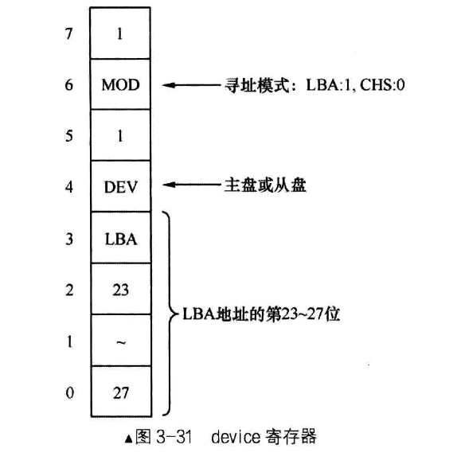

## 操作硬盘 

如下为机械硬盘


### 一、硬盘相关概念

CPU 通过 IO 接口与硬盘通信，针对硬盘的 IO 接口是“硬盘控制器”。硬盘控制器和硬盘是连接在一起的，是专门驱动硬盘设备的模块电路。这种接口也称为集成设备电路（Integrated Drive Electronics，IDE）。后来，又将此接口使用的技术规范归纳成全球硬盘标准，于是产生了 ATA（Advanced Technology Attachment）。硬盘串行接口称为（Serial ATA，SATA），硬盘并行接口称为（Parallel ATA，PATA）。

PATA 接口的线缆称为 IDE 线，一个 IDE 线上可以挂两块硬盘，一个是主盘（Master）、一个从盘（Slave）。现代的主盘和从盘之间的区别不明显了。主板上提供两个 IDE 插槽，分别位 IDE0 和 IDE1。支持 4 块 IDE（PATA）硬盘。

按照 ATA 标准，这两个插槽称为“通道”，IDE0 称为 Primary 通道，IDE1 称为 Secondary 通道。也就是说，每个通道上分别有主盘和从盘。

让硬盘工作，需要通过读写硬盘控制器的端口，端口就是位于 IO 控制器上的寄存器，此处就是硬盘控制器上的寄存器。

如下是硬盘控制器主要端口寄存器：


端口分为两种，`Command Block registers` 用于向硬盘驱动器写入命令字或者从硬盘控制器获取硬盘状态。`Control Block registers` 用于控制硬盘工作状态。

下面重点介绍下 `Command Block registers` 组的寄存器。

- 端口是按照通道给出的，一个通道上有主、从两块硬盘。想要操作某通道上的某块硬盘，需要通过寄存器指定。device 寄存器的第4 位用于指定通道上的主、从硬盘，0 位主盘，1 位从盘。
- data 寄存器（16 位）负责管理数据，作用是读取或者写入数据。
  - 在读硬盘时，硬盘准备好数据后，硬盘控制器便将其放在内部的缓冲区中，不断读此寄存器便是读出缓冲区中的全部数据。
  - 在写硬盘时，我们要把数据源源不断的输送到此端口，数据被存入缓冲区里，硬盘控制器发现这个缓冲区中有数据了，便将此处的数据写入相应的扇区。
- err / features 寄存器（8 位），他两是一个寄存器。
  - 在读取硬盘时，称为 err 寄存器，失败时有用，里面会记录失败的信息。
  - 在写硬盘时，称为 features 寄存器，有些命令需要指定额外参数，这些参数就写在 feature 寄存器中。
- sector count 寄存器（8 位），用来指定待读取或待写入的扇区数。硬盘每完成一个扇区，就会将此寄存器的值减 1。如果中间失败了，此寄存器中值是尚未操作的扇区。8 位最大值为 255，如果指定为 0，表示要操作 256 个扇区。

LBA（Logical Block Address）是一种逻辑上为扇区编址的方法，全称为逻辑块地址。LBA 有两种，一种是 LBA28，有 28 位，最大支持 `pow(2, 28) ` 个扇区，每个扇区 512 字节，最大支持 128 GB。另外一种是 LBA48，有 48 位，最大支持 `pow(2, 48)` 个扇区，最大支持 128 PB。我们采用 LBA28 模式。

LBA 寄存器，有 LBA low、LBA mid、LBA high 三个，都是 8 位宽度的。分别存储 LBA 28 位地址的  `0 - 7` 位、`8 - 15` 位、`16 - 23` 位。剩余的 4 位使用 device 寄存器。

- device 寄存器（8 位），低 4 位（0 - 3 位）存储 LBA 地址的低 `24 - 27` 位。第 4 位指定通道上的主盘或从盘，0代表主盘，1 代表从盘。第 6 位用来设置是否启用 LBA 方式，1 代表启用 LBA 模式，0 代表启用 CHS 模式。另外的第 5 位和第 7 位固定为 1，称为 MBS 位，不用管。

  

- status 寄存器（8 位），用在在读硬盘时，表示硬盘的状态信息。
  - 第 0 位是 ERR 位，如果此位为 1，表示出错，具体原因可见 err 寄存器。
  - 第 3 位是 data request 位，如果此位为 1，表示硬盘已经把数据准备好了，主机现在可以把数据读取出来。
  - 第 6 位是 DRDY 位，表示硬盘就绪，此位是在对硬盘诊断时用的，表示硬盘检测正常，可以继续执行一些命令
  - 第 7 位是 BSY 位，表示硬盘是否繁忙，如果为 1 表示硬盘正忙着
  - 其他位都无效，不用关注

  
  
- command 寄存器（8 位），command 寄存器和 status 寄存器是同一个寄存器。command 用在写硬盘时，用来存储让硬盘执行的命令，只要把命令写进此寄存器，硬盘就开始工作了。如下主要使用的三个命令
  - identify：0xEC，即硬盘识别
  - read sector：0x20，即读扇区
  - write sector：0x30，即写扇区

### 二、操作硬盘的方法

最主要的顺序是 command 寄存器一定得是最后写，因为一旦 command 寄存器被写入后，硬盘就开始工作了。如下我们约定一个顺序：

1. 先选择通道，往该通道的 sector count 寄存器中写入待操作的扇区数
2. 往该通道上的三个 LBA 寄存器写入扇区起始地址的低 24 位
3. 往 device 寄存器中写入 LBA 地址的 `24 - 27` 位，并置第 6 位为 1，使其为 LBA 模式，设置第 4 位，选择操作的硬盘（master 硬盘或 slave 硬盘）
4. 往该通道上的 command 寄存器写入操作命令
5. 读取该通道上的 status 寄存器，判断硬盘工作是否完成
6. 如果以上步骤是读硬盘，进入下一个步骤。否则，完工
7. 即那个硬盘数据读出

硬盘工作完成，他已经准备好了数据，获取的方式如下几种：

- 无条件传送方式
- 查询传送方式
- 中断传送方式
- 直接存储器存取方式（DMA）
- I/O 处理机传送方式

第一种无条件传送方式，数据源设备一定是随时准备好了数据，CPU 随时取、随时拿都没有问题，如寄存器、内存等设备，CPU 取数据不用提前打招呼

第二种查询传送方式，也称为 PIO 或程序 IO（ Programming Input/Output Model ）。传输前由程序先去检测设备的状态。数据源设备在一定条件下才能传送数据。CPU 需要数据时，先去检查该设备的状态，如果状态为准备好了，才能获取数据。硬盘中有 status 寄存器，存储了工作状态。这类数据通常是低速设备。这种方式需要 CPU 不断查询设备状态，只有最后一次的查询才是有意义的，效率低。

第三种中断传送方式，也称为中断驱动 IO。当数据源设备准备好数据后，通过发中断来通知 CPU 来拿数据。但中断方式下的 CPU 需要通过压栈来保护现场，还要执行传输指令，最后还要恢复现场。因此还有更高效的方案。

第四种直接存储器存取方式（DMA），不让 CPU 参与传输，完全由数据源设备和内存直接传输，CPU 直接从内存中拿数据即可。DMA 是由硬件实现，需要 DMA 控制才可以。此方式中，在数据输入之后或输出之前还是有一部分工作要由 CPU 来完成，如数据交换、组合、校验等。

第五种 IO 处理机传送方式，又引入了新的硬件：IO 处理机。专门用于处理 IO，也是一种处理器，只不过用的是另一套擅长 IO 的指令系统，随时可以处理数据。有了 IO 处理机的帮助，CPU 甚至可以不知道有传输这回事。

我们当前的系统使用第 2 、3 种方式来学习。

### 三、让 MBR 使用硬盘

使用 `xchg bx, bx` 进行 bochs 下断点调试

首先来看看头文件：

```
; loader 和 kernel
LOADER_BASE_ADDR equ 0x900
LOADER_START_SECTOR equ 0x2
```

如下是 `mbr.s` 的实现：

```
%include "boot.inc"
SECTION MBR vstart=0x7c00
mov ax, cs
mov ds, ax
mov es, ax
mov ss, ax
mov fs, ax
mov sp, 0x7c00
mov ax, 0xb800
mov gs, ax 

; 清屏
mov ax, 0x600
mov bx, 0x700
mov cx, 0
mov dx, 0x184f

int 0x10

; 操作显存
mov byte [gs:0x00], 'I'
mov byte [gs:0x01], 0x9F

mov byte [gs:0x02], ' '
mov byte [gs:0x03], 0x9F

mov byte [gs:0x04], 'M'
mov byte [gs:0x05], 0x9F

mov byte [gs:0x06], 'B'
mov byte [gs:0x07], 0x9F

mov byte [gs:0x08], 'R'
mov byte [gs:0x09], 0x9F

xchg bx, bx

; 起始扇区 LBA 地址
mov eax, LOADER_START_SECTOR
; 写入的地址
mov bx, LOADER_BASE_ADDR
; 待读入的扇区数
mov cx, 1
; 读取程序的起始部分
call rd_disk_m_16

jmp LOADER_BASE_ADDR


; 读取硬盘的 N 个扇区
rd_disk_m_16:
    ; 备份 eax
    mov esi, eax
    ; 备份 cx
    mov di, cx

    ; 如下为读写硬盘

    ; 第一步：设置要读取的扇区数
    mov dx, 0x1f2
    mov al, cl 
    out dx, al   ; 设置要读取的扇区数

    mov eax, esi  ; 恢复 ax
    
    ; 第二步：将 LBA 地址存入 0x1f3 - 0x1f6
    ; LBA 地址 7 - 0 位写入端口 0x1f3
    mov dx, 0x1f3
    out dx, al 

    ; LBA 地址 15 - 8 位写入端口 0x1f4
    mov cl, 8
    shr eax, cl
    mov dx, 0x1f4 
    out dx, al 

    ; LBA 地址 23 - 16 位写入端口 0x1f5
    shr eax, cl 
    mov dx, 0x1f5
    out dx, al 

    ; LBA 地址 27 - 24 位写入端口 0x1f6
    ; 要使用 device 寄存器
    shr eax, cl 
    and al, 0x0f  ; 只使用 al 的低 4 位用于 LBA 地址的 27 - 24 位
    ; 设置 device 寄存器的 7 - 4 位
    ; 第 5 、7 位固定为 1，第 6 位表示寻址模式，LBA:1, CHS:0
    ; 第 4 位表示主盘(0)还是从盘(0)
    or al, 0xe0
    mov dx, 0x1f6
    out dx, al 

    ; 第三步：向 0x1f7 端口写入读命令，0x20
    mov dx, 0x1f7
    mov al, 0x20
    out dx, al

    ; 第四步：检测硬盘状态
    .not_ready:
    		; 空操作，为了增加延时
        nop
        ; 从 0x1f7 端口读信息，读到 al 寄存器中
        ; 0x1f7 端口在读的时候，对应的 status 寄存器中，第 3 位为 1 表示准备好数据，可以输出，第 7 位为 1 表示磁盘正忙
        in al, dx 
        and al, 0x88
        cmp al, 0x08
        ; jnz 检测前一个操作的结果，如果非 0，则跳转
        jnz .not_ready

    ; 第 5 步：从 0x1f0 端口读数据
    ; di 中是备份的 cx，也就是要读取的扇区数
    mov ax, di 
    ; 一个扇区有 512 字节，所以读入一个字，需要 (di * 512 / 2) 次
    mov dx, 256
    ; mul 指令将源操作数和 ax 寄存器中值相乘，结果保存在 dx:ax 寄存器中
    mul dx 
    mov cx, ax 

    mov dx, 0x1f0 

    .go_on_read:
        in ax, dx 
        ; 每次从 data 寄存器中读 2 字节，写到 bx 寄存器指向的内存；写一次给 bx 指向的位置加 2
        mov [bx], ax 
        add bx, 2
        loop .go_on_read
        ret

times 510-($-$$) db 0
db 0x55, 0xaa
```

 如下是 `loader.s` 的实现：

```
%include "boot.inc"

section loader vstart=LOADER_BASE_ADDR
mov ax, 0xb810
mov gs, ax 

; 操作显存
mov byte [gs:0x00], '2'
mov byte [gs:0x01], 0xA4

mov byte [gs:0x02], ' '
mov byte [gs:0x03], 0xA4

mov byte [gs:0x04], 'L'
mov byte [gs:0x05], 0xA4

mov byte [gs:0x06], 'O'
mov byte [gs:0x07], 0xA4

mov byte [gs:0x08], 'A'
mov byte [gs:0x09], 0xA4

mov byte [gs:0x0a], 'D'
mov byte [gs:0x0b], 0xA4

mov byte [gs:0x0c], 'E'
mov byte [gs:0x0d], 0xA4

mov byte [gs:0x0e], 'R'
mov byte [gs:0x0f], 0xA4

jmp $
```

其中 bochs 的配置：

```
megs: 32

romimage: file="/usr/local/share/bochs/BIOS-bochs-latest"
vgaromimage: file="/usr/local/share/bochs/VGABIOS-lgpl-latest"

boot: disk

log: bochs.out

# 增加此项，允许下断点调试
magic_break: enabled=1
display_library: x, options="gui_debug"

mouse: enabled=0
# keyboard: type=mf, serial_delay=250, paste_delay=100000, user_shortcut=none
# map=/usr/local/share/bochs/keymaps/x11-pc-us.map

ata0: enabled=1, ioaddr1=0x1f0, ioaddr2=0x3f0, irq=14
ata0-master: type=disk, path="a.img", mode=flat, cylinders=121, heads=16, spt=63

# gdbstub: enabled=1, port=1234, text_base=0, data_base=0, bss_base=0
```

然后是编译调试：

```
nasm -o mbr.bin mbr.s
nasm -o loader.bin loader.s
dd if=mbr.bin of=a.img bs=512 count=1 conv=notrunc
dd if=loader.bin of=a.img bs=512 count=1 seek=2 conv=notrunc
bochs -q -f bochsrc_01.txt 
```

关于代码中的一些重要的部分解释如下：

- 我们为什么需要备份 eax 寄存器呢？因为 al 在 out 指令中会用到
- 包括 cx 寄存器也需要备份，因为 cx 一般用在循环时

```
# 硬盘的配置
ata0: enabled=1, ioaddr1=0x1f0, ioaddr2=0x3f0, irq=14
ata0-master: type=disk, path="a.img", mode=flat, cylinders=121, heads=16, spt=63
```

如上是硬盘的配置，我们的虚拟硬盘属于 ata0，是 Primary 通道，所以 sector count 寄存器是由 0x1f2 端口来访问。ata0-master 表明 `a.img` 是主盘。
