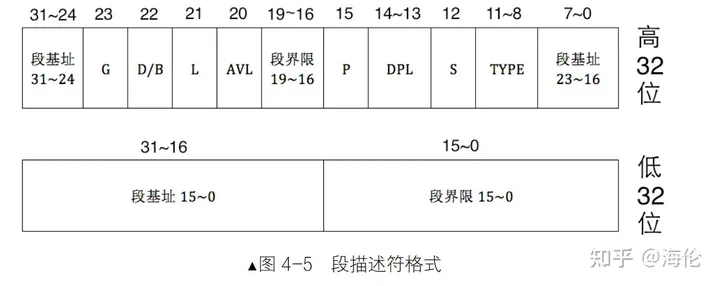
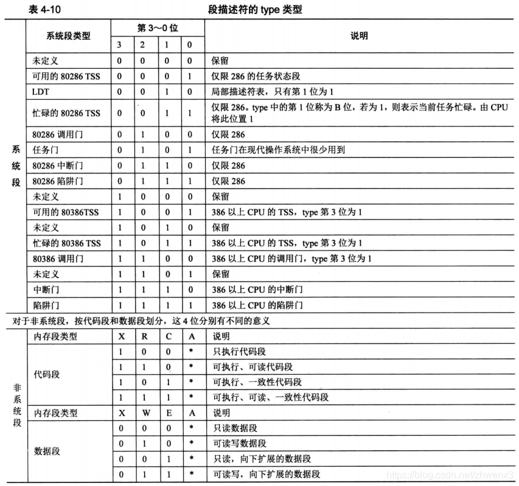
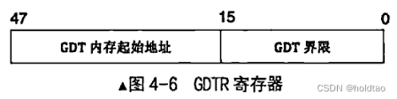
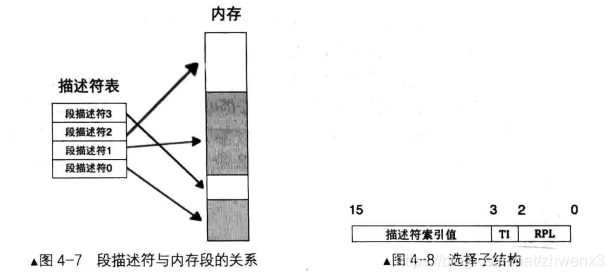
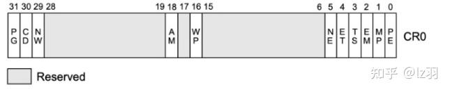

## 保护模式

为什么要有保护模式？

安全原因，用户程序和操作系统的数据可以被随意修改，一旦出现问题将是灾难性的，而且不容易排查

- 实模式下操作系统和用户程序属于同一特权级，没有区分对待
- 用户程序所引用的地址都是指向真实的物理地址
- 用户程序可以自由修改段基址，可以访问所有内存

使用的硬伤

- 访问超过 64KB 的内存区域要切换段基址，特别麻烦
- 一次只能运行一个程序，无法充分利用计算机资源
- 共 20 条地址线，最大可用内存为 1MB，这就是最大的硬伤了。

### 一、段描述符

如下图为段描述符的结构，该结构 8 字节大小。



**段界限**，表示段边界的扩展最值，即最大扩展到多少或者最小扩展到多少。扩展方向只有上下两种。

- 对于数据段和代码段，段的扩展方向是向上，即地址越来越高，此时的段界限用来表示段内偏移的最大值；
- 对于栈段，段的扩展方向是向下，即地址越来越低，此时的段界限用来表示段内偏移的最小值。

段界限用 20 个二进制位来表示，他的单位可以是字节，可以是 4KB。这是由段描述符的 G 位来指定，因此段的大小可以是 `pow(2, 20) ==> 1MB`，也可以是 `pow(2, 20) * 4KB ==> 4GB`。

段界限是个偏移量，从 0 算起，所以实际的段界限边界值：`(段描述符中段界限 + 1) * (段界限的粒度大小：4KB 或者 1) - 1`

其中，如果 G 位为 0，表示段界限粒度为 1字节，G 位为 1，表示为 4KB。

段界限用来限制段内偏移地址，段内偏移地址必须位于段的范围之内，否则 CPU 会抛异常。根据段的扩展方向，“段界限*单位”是段内偏移地址的最大值，任何超过此值的偏移地址都被认为是非法地址，CPU 硬件负责检查，检测到错误后 CPU 会触发相应的异常，我们负责写相应的异常处理程序。

**S字段**，一个段描述符，在 CPU 眼里分为两大类，系统段（S为0）和数据段（S为1）。凡是硬件运行需要的东西称为系统，凡是软件需要的东西称为数据。

**type字段**，共 4 位，用来指定本描述符的类型。type 字段要和 S 字段配合才能确定段描述符的类型，只有 S 字段的值确定后，type 字段的值才有意义。系统段比如：调用门、任务门。数据段比如：代码段。



我们主要关注非系统段。表中 A 位表示 Accessed 位，由 CPU 设置，每当该段被 CPU 访问过后，CPU 就将此位置 1。所以，创建一个新段描述符，将此位置 0。在调试时，根据此位可以判断该描述符是否可用。

C 位表示 Conforming，一致性代码段，表示如果自己是转移的目标段，并且自己是一致性代码段，自己的特权级一定要高于当前特权级，转移后的特权级不与自己的 DPL 为主，而是与转移前的低特权级一致，也就是听从、依从转移前的低特权级。C 为 1 时则表示该段是一致性代码段，C 为 0 表示为非一致性代码段。

R 位表示可读，1 为可读，0 为不可读。这个属性用来限制代码段的访问。

X 位表示该段是否可执行，EXecutable，代码段可执行，X 为 1；数据段不可执行，X 为 0

E 位用来表示段的扩展方向，Extend。E 为 0 表示向上扩展，即地址越来越高，通常用于代码段和数据段。E 为 1 表示向下扩展，地址越来越低，通常用于栈段。

W 位指段是否可写，Writable，W 为 1 表示可写，通常用于数据段。W 为 0 表示不可写，通常用于代码段。对 W 为 0 的段写入，会引发 CPU 抛出异常。

**DPL字段**，即 `Descriptor Privilege Level` 描述符特权级，这是保护模式提供的安全解决方案。共 2 位，表示 4 种特权级，分别是 0、1、2、3 级特权，数字越小，特权级越大。CPU 由实模式进入保护模式后，特权级自动为 0。因为保护模式下的代码已经是操作系统的一部分，所以操作系统应该处于最高的 0 特权级别。用户程序通常处于 3 特权级，权限最小。

**P字段**，即 `Present` 表示段是否存在。如果段存在于内存中，P 为 1，否则 P 为 0。P 字段由 CPU 检查，如果 P 为 0，CPU 将抛出异常，转到相应的异常处理程序，这个异常处理程序是程序员来写，在异常处理完成后要将 P 置为 1。也就是说，P 字段，CPU 只负责检查，程序员负责赋值。

**AVL字段**，即 AVaiLable ，这一位没有专门用途

**L字段**，用来设置是否为 64 位代码段，L 为 1 表示 64 位代码段，否则表示 32 位代码段。

**D/B字段**，用来指示有效地址（段内偏移地址）及操作数的大小。这个字段是为了兼容 286 的保护模式，因为 286 的保护模式下的操作数是 16位。

对代码段来说，此位是 D 位，若 D 为 0，表示指令中的有效地址和操作数是 16 位，指令有效地址用 IP 寄存器。若 D 为 1，表示指令中的有效地址及操作数是 32 位，指令有效地址用 EIP 寄存器。

对于栈段，此位是 B 位，用来指定操作数大小，此操作数涉及到栈指针寄存器的选择及栈的地址上限。若 B 为 0，使用的是 sp 寄存器，也就是栈的起始地址是 16 位寄存器的最大寻址范围：0xFFFF。若 B 为 1，使用的是 esp 寄存器，也就是栈的起始地址是 32 位寄存器的最大寻址范围：0xFFFFFFFF。

**G字段**，即 `Granularity` 粒度，用来指定段界限的单位大小。若 G 为 0，表示段界限的单位是 1 字节，这样段最大是 `pow(2,20)`，即 1MB。若 G 为 1，表示段界限的单位是 4KB，这样段最大是 `pow(2,20) * 4KB`，即 4GB。

### 二、全局描述符表

全局描述符表（Global Descriptor Table，GDT）是保护模式下内存段的登记表。GDT 相当于描述符的数组，数组中的每个元素都是 8 字节的描述符。GDT 位于内存中，寄存器 GDTR（48位） 即 `GDT Register` 专门用来存储 GDT 的内存地址以及大小。



这 48 位中前 16 位是 GDT 以字节为单位的界限值，相当于 GDT 的字节大小减 1。后 32 位是 GDT 的起始地址。由于 GDT 的大小是 16 位二进制，其表示的范围是 `pow(2, 16) = 65536 字节`，因此 GDT 最多容纳的描述符数量是 `65536 / 8 = 8192` 个。即 GDT中可以容纳 8192 个段或门。

只能使用 lgdt 指令，格式为：`lgdt 48位内存数据 `。此指令一般在实模式下使用，但在保护模式下也能执行，也就是可以重新换个 GDT 加载。

### 三、选择子

段寄存器 CS、DS、ES、FS、GS、SS，在实模式下，段中存储的是段基地址，即内存段的起始地址。而在保护模式下，由于段基址已经存入了段描述符中，因此在段寄存器中存入的是**选择子**（selector）。



由于段寄存器是 16 位，选择子也是 16 位。

在其低 2 位（第0 - 1位）用来存储 RPL，即请求特权级，可以表示 0、1、2、3 四种特权级。

第 2 位是 TI 位，即 `Table Indicator`，用来指示选择子是在 GDT、LDT 中的索引描述符。TI 为 0 表示在 GDT 中索引描述符，TI 为 1 表示在 LDT 中索引描述符。

选择子的高 13 位，第 3 - 15 位是描述符的索引值，用此值在 GDT 中索引描述符。选择子中的索引值相当于 GDT 中的下标。13 位的索引值，`pow(2, 13) = 8192` ，最多索引 8192 个段，这和 GDT 中最多定义 8192 个描述符是吻合的。

到了保护模式中，由于已经是 32 位地址线和 32 位寄存器，任意一寄存器都能够提供 32 位地址，因此直接用选择子对应的“段描述符中的段基址”加上“段内偏移地址”就是要访问的内存地址。

GDT 的第 0 个描述符不可用。如下举个例子：

例如选择子是 0x8，将其加载到 ds 寄存器后，访问 `ds:0x9` 这样的内存，其过程是：0x8 的低 2 位是 RPL，其值为 00。第 2 位是 TI，其值为 0，表示是在 GDT 中索引段描述符。用 0x8 的高 13 位 0x1 在 GDT 中索引，也就是 GDT 的第 1 个段描述符。假设第 1 个段描述符中的段基址为 0x1234。CPU 将 0x1234 作为段基址，与段内偏移地址 0x9 相加，`0x1234 + 0x9 = 0x123d`。用所得的和 0x123d 作为访存地址。

### 四、局部描述符表

局部描述符表，称为 LDT，即 `Local Descriptor Table`，他是 CPU 厂商在硬件一级原生支持多任务而创造的表。现代操作系统中很少有用 LDT 的。

CPU 厂商建议每个任务的私有内存段都应该放到自己的段描述符表中，该表就是 LDT。即每个任务都有自己的 LDT，随着任务切换，也要切换相应任务的 LDT。LDT 也位于内存中，其地址需要先被加载到某个寄存器后，CPU 才能使用 LDT。

### 五、打开 A20 地址线

实模式下的地址环绕，实模式下采用 “段基址 : 段内偏移地址”。段基址要乘以 16 后再加上段内偏移地址。实模式下的寄存器都是 16 位。因此寻址范围为：`0x00000 - 0xFFFFF`，最大寻址范围为 1MB。超过 1MB 的部分会自动回绕到 0 地址，继续从 0 地址开始映射。相当于把地址对 1MB 求模。

地址线从 0 开始编号，在 8086/8088 中，只有 20 位地址线，即 A0 - A19。使用这 20 位地址线的 CPU，不需要额外操作便能自动实现地址环绕。当地址进位到 1MB 以上，如 0x100000，由于没有第 21 位地址线，相当于丢掉了进位 1，变成了 0x00000。

对于 80286 后续的 CPU，通过 A20GATE 来控制 A20 地址线。IBM 在键盘控制器上的一些输出线来控制第 21 根地址线（A20）的有效性，因此被称为 A20GATE。

- 如果 A20GATE 被打开，当访问到 `0x100000 - 0x10FFEF` 之间的地址时，CPU 将真正访问这块物理内存
- 如果 A20GATE 被禁止，当访问 `0x100000 - 0x10FFEF` 之间的地址时，CPU 将采用 8086/8088 的地址回绕

地址回绕是为了兼容 8086/8088 的实模式，在保护模式中，我们需要突破第 20 条地址线（A20）去访问更大的内存空间。因此需要关闭地址回绕才能实现，也就是打开 A20GATE。

打开 A20GATE 的方式，就是将端口 0x92 的第 1 位置 1 即可。

```
in al, 0x92
or al, 0000_0010B
out 0x92, al
```

### 六、保护模式的开关，CR0 寄存器的 PE 位

CRO 寄存器是控制寄存器。第 0 位是 PE 位，`Protection Enable` 用于启用保护模式，是保护模式的开关。打开此位后，CPU 才能真正进入保护模式。



PE 为 0 表示在实模式下运行，PE 为 1 表示在保护模式下运行。因此 PE 为置 1 的代码如下：

```
mov eax, cr0
or eax, 0x00000001
mov cr0, eax
```

### 七、进入保护模式

进入保护模式，需要三个步骤：

1. 打开 A20 
2. 加载 gdt
3. 将 cr0 的 PE 位置 1


