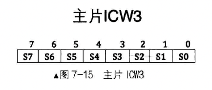
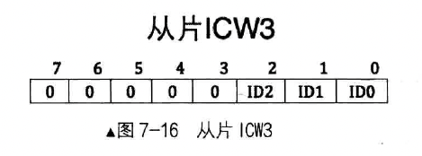
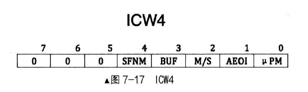
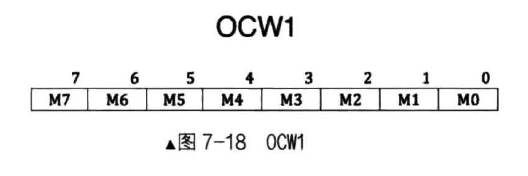
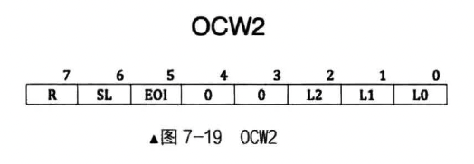

对 8259A 的编程就是对他的初始化，设置主片与从片的级联方式，指定起始中断向量号以及设置各种工作模式。

8259A 内部有两组寄存器，

- 一组是初始化命令寄存器组，用来保存初始化命令字（Initialization Command Words，ICW），ICW 共 4 个，`ICW1 - ICW4`。
- 另一组是操作命令寄存器组，用来保存操作命令字（Operation Command Words，OCW），OCW 共 3 个，`OCW1 - OCW3`

我们对 8259A 的编程，也分为初始化和操作两部分。

- 一部分是用 ICW 做初始化，用来确定是否需要级联，设置起始中断向量号，设置中断结束模式。其编程是往 8259A 的端口发送一系列 ICW。由于从一开始就要决定 8259A 的工作状态，并且设置之间具有关联、依赖性，所以必须依次写入 `ICW1、ICW2、ICW3、ICW4`
- 另一部分是用 OCW 来操作控制 8259A，OCW 的发送顺序不固定，先发送那个都可以。

下面分别说下每个 ICW 和 OCW。

### 一、四种 ICW 格式

#### 1. ICW1

`ICW1` 用来初始化 8259A 的连接方式和中断信号的触发方式。连接方式是指用单片工作，还是用多片级联工作。触发方式是指中断请求信号是电平触发还是边沿触发。

注意，ICW1 需要写入到主片的 `0x20` 端口和从片的 `0xA0` 端口

- IC4 表示是否要写入 ICW4。当 IC4 为 1 时表示需要在后面写入 ICW4，为 0 时则不需要。注意：x86 系统 IC4 必须为 1
- SNGL 表示 single，若 SNGL 为 1，表示单片，若 SNGL 为 0，表示级联。若在级联模式下，涉及到主片（1个）和从片（多个）用哪个 IRQ 接口互相连接的问题，所以 SNGL 为 0 时，主片和从片也是需要 ICW3 的
- ADI（call address interval），用来设置 8085 的调用时间间隔，x86 不需要设置。设置为 0 即可
- LTIM（level/edge triggered mode），用来设置中断检测方式，LTIM 为 0 表示边沿触发，LTIM 为 1 表示电平触发
- 第 4 位的 1 是固定的，这是 ICW1 的标记
- 第 5 - 7 位，专用于 8085 处理器，x86 不需要，直接置 0 即可

#### 2. ICW2

用来设置起始中断向量号，就是硬件 IRQ 接口到逻辑中断向量号的映射。由于每个 8259A 芯片上的 IRQ 接口是顺序排列的，所以只需要指定 IRQ0 映射到的中断向量号，其他 IRQ 接口对应的中断向量号会顺着自动排下去。

ICW2 需要写入主片的 `0x21` 端口和从片的 `0xA1` 端口

由于只需要设置 IRQ0 的中断向量号，`IRQ1 - IRQ7` 的中断向量号是 IRQ0 的顺延，因此我们负责填写高 5 位：`T3 - T7`，`ID0 - ID2` 这低三位不用我们负责。因此我们这高 5 位都是 8 的倍数，这个数字表示的便是设定的起始中断向量号。

`ID0 - ID2` 这低三位能表示 8 个中断向量号，这由 8259A 根据 8 个 IRQ 接口的排列位次自行导入，`IRQ0`的值为 000，IRQ1 的值为 001，依此类推。这样高 5 位和低 3 位便表示了任意一个 IRQ 接口实际分配的中断向量号。

#### 3. ICW3

ICW3 仅在级联的方式下才需要（如果 ICW1 中的 SNGL 为 0），用来设置主片和从片用那个 IRQ 接口互连。

ICW3 需要写入主片的主片的 `0x21` 端口以及从片的 `0xA1` 端口。

主片和从片的级联方式不一样，因此 ICW3 的主片和从片有不同的结构。

 

对于主片，ICW3 中置 1 的那一位对应的 IRQ 接口用于连接从片，若为 0 则表示接外部设备。比如，若主片 IRQ2 和 IRQ5 接有从片，则主片的 ICW3 为 `0010 0100`

对于从片，要设置与主片 8259A 的连接方式，只需要在从片上指定主片用于连接自己的那个 IRQ 接口就行。

在中断响应时，主片会发送与从片做级联的 IRQ 接口号，所有从片用自己的 ICW3 的低 3 位和它对比，若一致则认为是发给自己的。比如主片用 IRQ2 接口连接从片 A，用 IRQ5 接口连接从片 B，从片 A 的 ICW3 的值就应该设为 `0000 0010`，从片 B 的 ICW3 的值应该设为 `0000 0101`，所以，从片的 ICW3 中的低 3 位 `ID0 - ID2` 就够了，高 5 位不需要，为 0 即可。

#### 4. ICW4

用于设置 8259A 的工作模式，当 ICW1 中的 IC4 为 1 时才需要 ICW4。

注意：ICW4 需要写入主片的 `0x21`及从片的 `0xA1` 端口

- 第 7 - 5 位未定义，直接置 0 即可
- SFNM（Special Fully Nested Mode）：表示特特殊全嵌套模式。若  SGNM 为 0，则表示全嵌套模式，若 SGNM 为 1，表示特殊全嵌套模式。一般填 0
- BUF：表示本 8259A 芯片是否工作在缓冲模式。BUF 为 0，则工作在非缓冲模式，BUF 为 1，则工作在缓冲模式。一般填 0
- 当多个 8259A 级联时，如果工作在缓冲模式下，M/S 用来规定本 8259A 是主片，还是从片。若 M/S 为 1，则表示是主片，若 M/S 为 0，则表示是从片。若工作在非缓冲模式（BUF=0），则 M/S 无效，填 0 即可。
- AEOI：表示自动结束中断（Auto End Of Interrupt），8259A 在收到中断结束信号时才能继续处理下一个中断，此项用来设置是否要让 8259A 自动把中断结束。若 AEOI 为 0，则表示非自动，即手动结束中断，我们可以在中断处理程序中或主函数中手动向 8259A 的主、从片发送 EOI 信号。若 AEOI 为 1，则表示自动结束中断
- u PM：表示微处理器类型，此项是为了兼容老处理器，若 uPM 为 0，则表示 8080 或 8085 处理器，若 uPM 为 1，则表示 x86 处理器。

### 二、四种 OCW 格式

#### 1. OCW1

OCW1 用来屏蔽连接在 8259A 上的外部设备的中断信号，实际上就是把 OCW1 写入 IMR 寄存器。这里的屏蔽是说是否把来自外部设备的中断信号转发给 CPU。

由于外部设备的中断都是可屏蔽中断，所以最终还是要受标识寄存器 eflags 中的 IF 位的管束，若 IF 位为 0，可屏蔽中断全部被屏蔽，也就是说在 IF 位为 0 的情况下，即使 8259A 把外部设备的中断向量号发过来，CPU 也置之不理。

注意：OCW1 要写入主片的 0x21 或从片的 0xA1 端口

`M0 - M7` 对应 8259A 的 `IRQ0 - IRQ7` ，某位为 1，对应的 IRQ 上的中断信号就被屏蔽了。否则为 0，则不屏蔽。

#### 2. OCW2

用来设置中断结束方式和优先级模式

注意：OCW2 要写入到主片的 0x20 和从片的 0xA0 端口

由高 3 位 R、SL、EOI 可以定义多种中断结束方式和优先级循环方式。

OCW2 一个作用是可以用来发 EOI 信号结束中断。

- 如果使 SL 为1，可以用 OCW2 的低 3 位（L2 - L0）来指定位于 ISR 寄存器中的哪一个中断被终止，也就是结束那个 IRQ 接口的中断信号。
- 如果使 SL 为 0，`L2 - L0` 便不起作用，8259A 会自动将正在处理的中断结束，也就是把 ISR 寄存器中优先级最高的位清 0。

OCW2 的另一个作用是设置优先级控制方式

- SL，Specific Level，表示是否指定优先等级。等级是用低三位来指定的。此处的 SL 只是开启低 3 位的开关，所以 SL 也表示低 3 位的 `L2 - L0` 是否有效。SL 为 1 表示有效，SL 为 0 表示无效。

- EOI，End Of Interrupt，为中断结束命令位。令 EOI 为 1，则会令 ISR 寄存器中的相应位清 0，也就是将当前处理的中断清掉，表示处理结束。向 8259A 主动发送 EOI 是手工结束中断的做法，所以，使用此命令有个前提，就是 ICW4 中的 AEOI 位为 0，非自动结束中断时才用。

  值得注意的是在手动结束中断（AEOI 位为 0）的情况下，如果中断来自主片，只需要向主片发送 EOI 就行了，如果中断来自从片，除了向从片发送 EOI 之外，还要向主片发送 EOI。

- 第 `4 - 3`位的 00 是 OCW2 的标识

#### 3. OCW3

用于设定特殊屏蔽方式及查询。我们不用

### 三、小总结

ICW1 和 OCW2、OCW3 是用偶地址端口 0x20（主片）或 0xA0（从片）写入

`ICW2 - ICW4` 和 OCW1 是用奇地址端口 0x21（主片）或 0xA1（从片）写入

以上 4 个 ICW 要保证一定的次序写入，所有 8259A 就知道写入端口的数据是什么了。

OCW的写入与顺序无关，并且 ICW1 和 OCW2、OCW3 的写入端口是一致的。那 8259A 怎么来辨识他们呢？通过各控制字中的第 `4 - 3` 位标识位，通过这两位的组合来唯一确定某个控制字。

8259A 的编程就是写入 ICW 和 OCW，下面总结下写入的步骤：

对于 8259A 的初始化必须最先完成，步骤是：

- 无论 8259A 是否级联，ICW1 和 ICW2 是必须要有的，并且要顺序写入
- 只有当 ICW1 中的 SNGL 位为 0 时，这表示级联，级联就需要设置主片和从片，这才需要在主片和从片中各写入 ICW3。注意，ICW3 的格式在主片和从片中是不同的
- 只能当 ICW1 中 IC4 为 1 时，才需要写入 ICW4。不过，x86 系统 IC4 必须为 1

在 x86 系统中，对于初始化级联 8259A，4 个 ICW 都需要，初始化单片 8259A，ICW3 不要，其余全要。

在以上初始化 8259A 之后才可以用 OCW 对它操作。

### 四、编写中断处理程序

Intel 8259A 芯片位于主板上的南桥芯片中，不需要像网卡、硬盘那样单独安装才能用，也不需要为它的各个 IR 引脚指定连接的外部设备。比如主片 IR0 引脚上就是时钟中断。

有的中断会产生错误码，用来指明中断是在那个段上发生的，错误码会在进入中断后，处理器在栈中压入寄存器 EIP 之后压入。

在中断发生时，处理器要在目标栈中保存被中断进程的部分寄存器环境，这是处理器自动完成的，不需要我们手动设置。保存的寄存器名称及顺序是：

- 如果发生了特权级转移，比如被中断的进程是 3 特权级，中断处理程序是 0 特权级，此时要把低特权级的栈段选择子 ss 及栈指针 esp 保存到栈中
- 压入标识寄存器 eflags
- 压入返回地址 cs 和 eip，先压入 cs，后压入 eip
- 如果此中断没有相应的错误码，至此，处理器把寄存器压栈的工作完成。如果此中断有错误码的话，处理器在压入 eip 之后后压入错误码。

因此，我们对哪些没有错误码的中断，压入一个 32 位的数，保证结构一致，处理简单。

因为硬盘是接在从片的引脚上，所以我们使用的 8259A 要采用主、从片级联的方式。在 x86 系统中，对于初始化级联 8259A，4 个 ICW 都需要，必须严格按照 `ICW1 - ICW4` 的顺序写入。

- ICW1 和 OCW2、OCW3 是用偶地址端口 `0x20`（主片）或 `0xA0`（从片）写入
- `ICW2 - ICW4` 和 OCW1 是用奇地址端口 `0x21`（主片）或者 0xA1（从片）写入

 我们列举一下编写中断处理程序的大的步骤：

1. 实现中断处理程序
2. 创建中断描述符表 IDT，安装中断处理程序
3. 设置或初始化 8259A
4. 加载 IDT，开启中断

