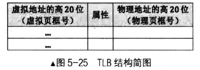

分页机制的问题：

- 虚拟地址到物理地址的映射过程过于繁琐，步骤较多
- CPU 和内存的速度差异非常大，页表在内存中，转换过程中频繁的内存访问，使得地址转换速度更慢，CPU 也需要停下来等待内存的响应

根据程序的局部性原理，处理器准备了高速缓存 TLB（`Translation Lookaside Buffer`，也称为快表），专门用来存放虚拟页和物理页的映射。如下是结构图

TLB 中条目是虚拟地址的高 20 位到物理地址高 20 位的映射结果，其实就是虚拟页到物理页的映射。除此之外，TLB 中还有一些属性位，比如页表项的 RW 属性。

有了 TLB 之后，CPU 寻址会先从 TLB 中查询，如果命中则返回物理页地址，否则会查询内存中的页表，获得物理页地址后再更新 TLB。

TLB 的一些问题：

第一点，TLB 高速缓存由于成本原因，容量比较小。TLB 中只有当前任务的部分页表。而且只有 P 位为 1 的页表项才会在 TLB 中，如果 TLB 满了，需要将很少使用的条目换出

第二点，TLB 是页表的缓存，处理器寻址时最先访问的是 TLB，TLB 中存储的是程序运行所依赖的指令和数据的内存地址，任何时刻都必须保证地址的有效性，否则程序必然出错，所以 TLB 必须实时更新。可是如果实时读取内存中的页表去更新 TLB 的话，又回到了从内存查询映射关系的老路了，TLB 反而成了鸡肋。因此，TLB 并不主动更新，处理器也不负责 TLB 的有效性，TLB 由操作系统开发人员维护，这很合理，维护页表的代码是开发人员写的，他们肯定知道何时修改了页表，或者修改了哪些条目。

有两种方法可以间接更新 TLB，一个是针对 TLB 中所有条目的方法，重新加载 CR3。比如将 CR3 寄存器的数据读出来再写入 CR3，这会使整个 TLB 失效。

另一个是针对 TLB 中某个条目的更新，处理器提供了指令 `invlpg(invalidate page)`，它用于在 TLB 中刷新某个虚拟地址对应的条目，处理器是用虚拟地址来检索 TLB 的。比如：`invlpg [0x1234]` 表示更新虚拟地址 0x1234 对应的条目。