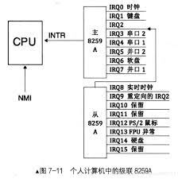
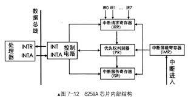

### 一、问题来源？

可屏蔽中断是通过 INTR 信号线进入 CPU 的，一般可独立运行的外部设备，如打印机、声卡等，其发出的中断都是可屏幕中断，都共享这一根 INTR 信号线通知 CPU。

任务是串行在 CPU 上执行的，CPU 每次只能执行一个任务。对于多个同时发生的中断应该如何处理呢？

如果使用 CPU 来做这个事情，不仅要占用 CPU 时间，而且还要占用内存来存储中断队列。因此 8259A 这个芯片出现了。

8259A 的作用是负责所有来自外设的中断，其中就包括来自时钟的中断。8259A 用于管理和控制可屏蔽中断，他表现在屏蔽外设中断，对他们实行优先级判决，向 CPU 提供中断向量号等功能。并且可以通过编程的方式来设置这些功能。

### 二、介绍 8259A

Inter 处理器共支持 256 个中断，但 8259A 只可以管理 8 个中断，因此 Inter 处理器提供了一种解决方案，将多个 8259A 组合，官方术语叫做：级联。

如果采用级联的方式，最多可级联 9 个，也就是最多支持 64 个中断。N 片 8259A 通过级联可支持 `7N+1` 个中断源。级联时只能有一片 8259A 为主片 master，其余的均为从片 slave。来自从片的中断只能传递给主片，再由主片向上传递给 CPU，也就是说，只有主片才会向 CPU 发送 INT 中断信号。

如下图，是级联的方式

我们在来看看 8259A 芯片内部结构：

它的内部有一些信号和寄存器，8259A 共 8 个 IRQ 接口，可以用 8 位寄存器中的每一位代表 8259A 的每个 IRQ 接口。

- INT：8259A 选出优先级最高的中断请求后，发信号通知给 CPU
- INTA：INT Acknowledge，中断响应号。位于 8259A 中的 INTA 接收来自 CPU 的 INTA 接口的中断响应信号
- IMR：Interrupt Mask Register，中断屏蔽寄存器，8 位。用来屏蔽某个外设的中断。相应位设置为 1 表示中断屏蔽。
- IRR：Interrupt Request Register，中断请求寄存器，8 位，它的作用是接受经过 IMR 寄存器过滤后的中断信号并锁存，此寄存器中全是等待处理的中断，相当于 5259A 维护的未处理中断信号队列
- PR：Priority Resolver，优先级仲裁器，当有多个中断同时发生，或当有新的中断请求进来时，将它与当前正在处理的中断进行比较，找出优先级更高的中断
- ISR：In-Service Register，中断服务寄存器，8 位，当某个中断正在被处理时，保存在此寄存器中

8259A 的工作流程如下：

- 当某个外设发出一个中断信号时，由于主板已经将信号通路指向了 8259A 芯片的某个 IRQ 接口，所以该中断信号最终被送入了 8259A。
- 8259A 首先检查 IMR 寄存器中是否已经屏蔽了来自该 IRQ 接口的中断信息。该 IRQ 接口对应的位如果被置为 1，则说明中断屏蔽，将中断信号丢弃，否则将其送入 IRR 寄存器，将该 IRQ 接口所在 IRR 寄存器中对应的 BIT 置 1
- 在某个恰当时机，优先级仲裁器 PR 会从 IRR 寄存器中挑选一个优先级最大的中断。（优先级判断：IRQ 接口号越小，优先级越大）之后，8259A 会在控制电路中，通过 INT 接口向 CPU 发送 INTR 信号。
- CPU 收到 INTR 信号后，于是 CPU 将手里的指令执行完后，马上通过自己的 INTA 接口向 8259A 的 INTA 接口回复一个中断响应信号，表示 CPU 已经准备好了。
- 8259A 在收到这个信号后，立即将刚才选出来的优先级最大的中断在 ISR 寄存器中对应的 BIT 置 1，同时，将该中断从 IRR 寄存器对应的位置置 0，也就是将该中断从“待处理中断队列” 寄存器 IRR 中去掉。
- 之后，CPU 在此发送 INTA 信号给 8259A，这一次是想获取中断对应的中断向量号。一般情况下，`该设备的中断向量号 = "起始中断向量号" + "IRQ接口"`。外部设备虽然发送中断信号，但是并不知道其内部会有中断向量号这一概念。
- 随后，8259A 将此中断向量号通过系统数据总线发送给 CPU，CPU 从数据总线上拿到该中断向量号后，用它查找中断向量表或者中断描述符表，找到相应的中断处理程序去执行
- 如果 8259A的 “EOI通知（End Of Interrupt）” 被设置为非自动模式（手工模式），中断处理程序结束时必须有向 8259A 发送 EOI 的代码，8259A 在收到 EOI 后，将当前正在处理的中断在 ISR 寄存器中对应的 BIT 置 0。如果 “EOI通知” 被设置为自动模式，在刚才 8259A 接受到第二个 INTA 信号后，也就是 CPU 向 8259A 要中断向量号的那个 INTA，8259A 会自动将此中断在 ISR 中对应的 BIT 位置 0
- 注意：并不是进入了 ISR 后的中断就可以被 CPU 执行，还是有可能被换下来的。比如：在 8259A 发送中断向量号给 CPU 之前，这时候又来了新的中断，且优先级较高，那么原来 ISR 中准备上 CPU 处理的旧中断，其对应的 BIT 位就得清 0，同时将它所在的 IRR 中的相应 BIT 恢复为 1，随后在 ISR 中将此优先级更高的新中断对应的 BIT 置 1，然后将此新中断的中断向量号发给 CPU。

那么，和中断相关的数据结构包括：中断描述符表和中断向量号。我们需要准备这两项。中断描述符表也称为 IDT，表中每一项都是 8 字节的描述符。中断描述符表本质上就是 “中断处理程序地址数组”，而中断向量号则是此数组的索引下标。因此，CPU 收到 8259A 送来的中断向量号后要将其乘以 8，再加上中断描述符表的起始地址，经过内存寻址，最终定位到目标中断处理程序。
