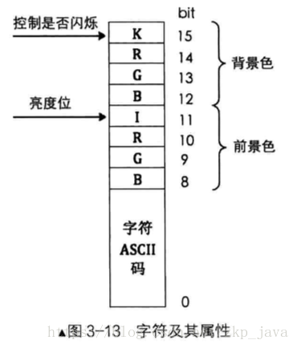

## 操作显示器

### 一、IO 接口

CPU 通过 "IO接口" 来与外设通信。“IO接口” 是连接 CPU 与外部设备的逻辑控制部件，分为硬件和软件两部分，

- 硬件部分所做的是一些实质具体的工作，其功能是协调 CPU 和外设之间的种种不匹配，如双方由于速度不匹配，那 IO 接口就实现数据缓冲以减少等待时间；如数据不匹配，IO 接口就在这两种格式间互相转换。
- 软件部分就是用来控制接口电路工作的驱动程序以及完成内部数据传输所需要的程序。

IO 接口芯片分为“可编程接口芯片”和“不可编程接口芯片”。一般我们都使用 “可编程接口”。通常使用端口读写指令 “in/out” 来实现。

同一时刻，CPU 只能和一个 IO 接口通信。面对多个 IO 接口，通过输入输出控制中心（I/O control hub，ICH），也就是南桥芯片，他的责任是除了仲裁 IO 接口的竞争，还要链接各种内部总线。

南桥用于连接 pci、pci-express、AGP 等低速设备，北桥用于连接高速设备，如内存。

```
# in 指令用于从端口中读取数据
in al, dx;
in ax, dx;
其中 al 和 ax 用来存储从端口获取的数据，dx 是指端口号。
只要用 in 指令，源操作数（端口号）必须是 dx。而目的操作数是用 al，还是 ax，取决于 dx 端口指代的寄存器为 8 位还是 16 位宽度

# out 指令用于往端口中写数据
out dx, al;
out dx, ax;
out 立即数, al;
out 立即数, ax;
out 指令的目的操作数是端口号
```

### 二、操作显卡

现在的显卡都是串口的，串口传输一次只发一位。传输速度不仅取决于并行的数据量，还要取决于传输频率。串口显卡一次虽然只传输一位，但传输频率高。

地址总线的范围不只是主板上插的内存条的容量，内存条只是地址总线所能达到的范围中的一小部分。指令中所需的任何一个地址，都是地址总线去寻址的。地址只是个数字，地址总线把此数字指向那个存储介质，此地址就落到了那个介质上的某个存储单元中。对于显卡的显存来说，从起始地址 `0xB8000 - 0xBFFFF` 这片 32KB 大小的内存区域是用于文本显示。我们往这块内存写数据，会直接写到显存中，显存有了数据，自然显卡就将其搬到显示器屏幕上了。

每个字符在屏幕上都是有两个字节来表示，而且是连续的两个字节。显存范围有 32KB，一屏可以显示 2000 个字符，显示器上的每个字符占 2 字节大小，所以每屏字符实际占用 4000 字节。这样 32KB 的显存可以容纳大约 8 屏的数据。所以我们可以有多个屏幕进行切换。

- 屏幕上每个字符的低字节是字符的 ASCII 码，高字节是字符的属性元信息。
- 高字节中，低 4 位是字符前景色，高 4 位是字符的背景色。其中第 4 位用来控制亮度，如果置 1 表示高亮。第 7 位用来控制字符是否闪烁（不是背景闪烁）



如下是文本模式中的字符颜色：

| R    | G    | B    | 颜色( I = 0 ) | 颜色( I = 1) |
| ---- | ---- | ---- | ------------- | ------------ |
| 0    | 0    | 0    | 黑            | 灰           |
| 0    | 0    | 1    | 蓝            | 浅蓝         |
| 0    | 1    | 0    | 绿            | 浅绿         |
| 0    | 1    | 1    | 青            | 浅青         |
| 1    | 0    | 0    | 红            | 浅红         |
| 1    | 0    | 1    | 紫            | 浅紫         |
| 1    | 1    | 0    | 棕            | 黄           |
| 1    | 1    | 1    | 白            | 亮白         |

如上，只要亮度位 I 置 1 ，颜色就是变亮变浅。

### 三、写代码操作显卡

```
SECTION MBR vstart=0x7c00
mov ax, cs
mov ds, ax
mov es, ax
mov ss, ax
mov fs, ax
mov sp, 0x7c00
mov ax, 0xb800
mov gs, ax 

; 清屏
mov ax, 0x600
mov bx, 0x700
mov cx, 0
mov dx, 0x184f

int 0x10

; 操作显存
mov byte [gs:0x00], 'I'
mov byte [gs:0x01], 0x9F

mov byte [gs:0x02], ' '
mov byte [gs:0x03], 0x9F

mov byte [gs:0x04], 'M'
mov byte [gs:0x05], 0x9F

mov byte [gs:0x06], 'B'
mov byte [gs:0x07], 0x9F

mov byte [gs:0x08], 'R'
mov byte [gs:0x09], 0x9F

; 使程序停在这里
jmp $

times 510-($-$$) db 0
db 0x55, 0xaa
```

如上代码，显存段基址放在那个寄存器中是没有关系的，可以不用 ds 做段基址寄存器。

