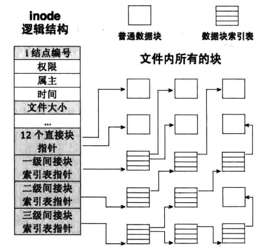
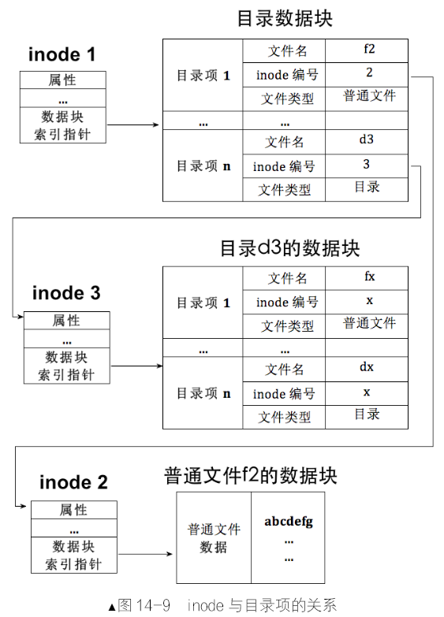
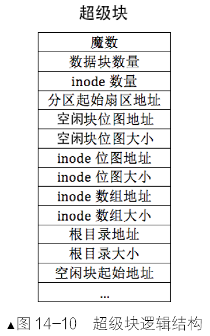
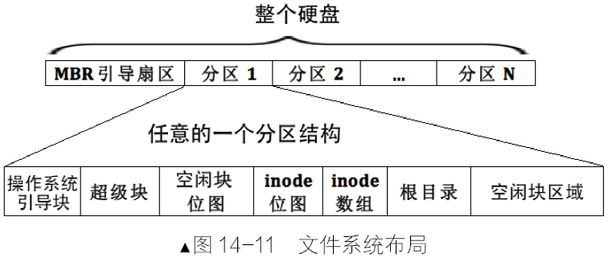

#### 1. inode

- 硬盘的读写单位是扇区。
- 文件系统的读写单位是“块”，一个块是由多个扇区组成。
- 文件系统中的文件至少要占据一个块，当文件体积大于一个块时，文件会被拆分成多个块。

因此我们需要将“块”组织起来。

unix 文件系统将文件以“索引结构”进行组织

- 优点：文件中的块依然可以分散到不连续的零散空间中，保证磁盘高利用率
- 优点：文件系统为每个文件的所有块建立了一个索引表，索引表就是块地址数组，每个数组元素就是块的地址，数组元素下标就是文件块的索引，这样访问任意一个块的时候，只要从索引表中获得块地址就可以

这种索引结构就是 inode（index node），用来索引、跟踪一个文件的所有块。因此 UNIX 文件系统中，一个文件对应一个 inode。

索引结构的缺点：索引表本身要占用一定的存储空间，文件越大，块就越多，索引表项就越多。

UNIX 采用的办法：将一部分块放在索引表中，如果文件很大，将其他块放在另一个索引表。具体做法：

- 每个索引表中共 15 个索引项，暂时称此索引表为老索引表。老索引表中前 12 个索引项时文件的前 12 个块的地址，他们是文件的“直接块”，即可直接获得地址的块。
- 如果文件大于 12 个块，那就再建立个新的块索引表，新索引表称为一级间接块索引表，表中可容纳 256 个块的地址。这 256 个块地址需要通过一级间接块索引表才能获取，因此称为“间接块”。此时文件最大可达到 `12+256=268` 个块
- 如果还不够大，那就建立二级间接块索引表，在老索引表中的第 14 个索引项存储二级间接索引表所在块的地址。此表中各表项存储的是一级间接块索引表。此时文件最大可达 `12+256+256*256=65804` 个块
- 还不够的话，建立三级间接块索引表，在老索引表中的第 15 个索引项存储三级间接块索引表所在块的地址。表中存储的是二级间接块索引表，然后这些二级间接块索引表中建立一级间接块索引表。此时文件最大可达：`12+256+256*256+256*256*256=16843020` 个块。

同时，inode 结构中，包括了一个文件的所有信息：

- i 结点编号是指此 inode 的序号，通常是指他在 inode 数组中的下标
- 权限是读、写、执行
- 属主是指文件的拥有者
- 时间是指创建时间、修改时间、访问时间
- 文件大小是指文件的字节尺寸
- 连续的各种块指针以及索引表指针是文件所有块的索引，也就是指向文件的实体部分

总结：inode 是文件在文件系统上的元信息（文件本身的元信息是他自己的文件头），要想通过文件系统获得文件的实体，必须先要找到文件的 inode。inode 的数量等于文件的数量，硬盘分区中所有文件的 inode 通过名为 inode_table 数组表示，此数组元素的下标便是文件 inode 的编号。

文件的数量间接决定了分区空间的利用率。说“间接”，是因为文件大小不一。于是一个分区的利用率分为 inode 的利用率和磁盘空间利用率两种，`df -i` 可以查看 inode 利用率，df 不带参数可查看空间利用率。

#### 2. 目录

在 Linux 中，目录和文件都用 inode 表示，目录也是文件。inode 结构相同，因此区分该 inode 是普通文件还是目录文件，唯一的地方只能是数据块本身的内容，即数据块的内容要么是普通文件本身的数据，要么是目录中的目录项。

目录项中包含文件名、inode 编号和文件类型等等。有如下作用：

- 标识此 inode 表示的是文件是目录，还是普通文件，也就是 inode 所指向的数据块中的内容是什么
- 将文件名与 inode 做个绑定关联，这样用户便可以通过文件名来找到文件的实体数据

因此，通过文件名找文件实体数据块的流程是：

- 在目录中找到文件名所在的目录项
- 从目录项中获取 inode 编号
- 用 inode 编号作为 inode 数组的索引下标，找到 inode
- 从该 inode 中获取数据块的地址，读取数据块

每个分区都有自己的根目录，创建文件系统之后他的位置就是固定不变的。查找任意文件时，都直接到根目录的数据块中找相关的目录项，然后递归查找，最终可以找到任意子目录中的文件。

#### 3. 超级块与文件系统布局

上文留下了几个问题，比如：

- inode 数组存储在哪里？大小是多少？
- 每个分区都有自己的根目录，但是他的地址在哪里？

针对这些元信息的存储问题，又引入了“超级块”。超级块中会保存：inode 数组的地址以及大小、inode 位图地址以及大小（用来管理 inode 的使用情况）、根目录的地址以及大小、空闲块位图的地址以及大小。

魔数通常用来确定文件系统的类型标志，然后调用不同的文件系统驱动程序访问该分区。

超级块的位置和大小是固定的，存储在各分区的第 2 个扇区，通常是占用一个扇区大小，具体大小与实际文件系统类型为准。

现在我们就清楚了我们整个文件系统的布局了，也是参考了 ext2 文件系统。

操作系统引导块：操作系统引导记录 OBR 所在的地址，即操作系统引导扇区。他位于各分区最开始的扇区。根据文件系统类型的不同，引导程序可能占用多个扇区，这多个扇区组成一个数据块