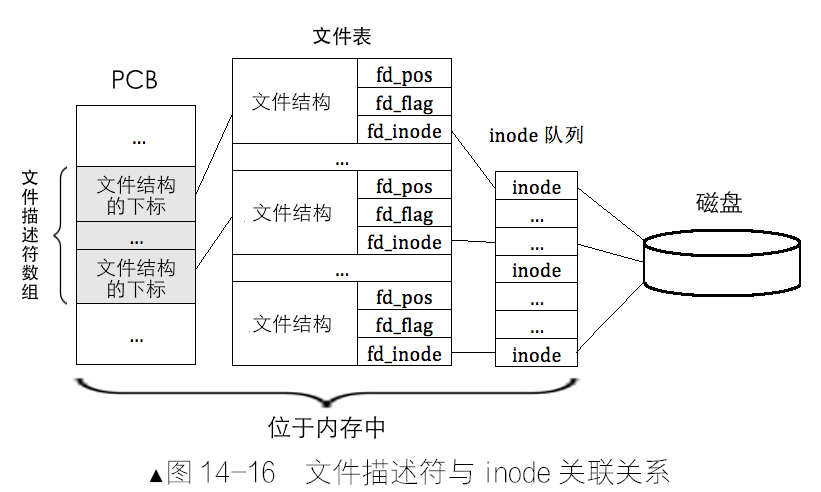

文件描述符和 inode 之间的关联关系

因此，Linux 中通过文件描述符查找文件数据块的过程，涉及如下三个数据结构：

- PCB 中的文件描述符数组
- 存储所有文件结构的文件表
- inode 队列，也就是 inode 缓存

因此，过程一般如下：

- 一个进程将文件描述符作为参数提交给文件系统时，文件系统用此文件描述符在该进程的 PCB 中的文件描述符数组索引对应的元素
- 从该元素中获取对应的文件结构的下标，用该下标在文件表中索引相应的文件结构。
- 从该文件结构中获取文件的 inode，最终找到文件的数据块
- 如果该 inode 在 inode 队列中不存在，此时：文件系统会从硬盘上将该 inode 加载到 inode 队列中，并使文件结构中的 fd_inode 指向它

那么 open 操作的本质是创建相应文件描述符的过程：

- 在全局的 inode 队列中新建一个 inode，返回该 inode 地址
- 在全局的文件表中找一空位，在该位置填充文件结构，使其 `fd_inode` 指向上一步中返回的 inode 地址，然后返回本文件结构在文件表中的下标值
- 在 PCB 中的文件描述符数组中找一空位，使该位置的值指向上一步中返回的文件结构下标，并返回本文件描述符在文件描述符数组中的下标值