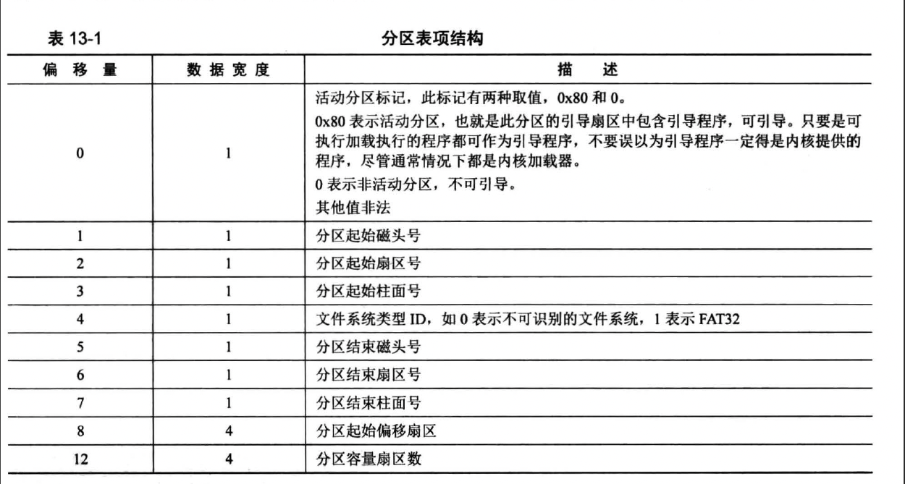
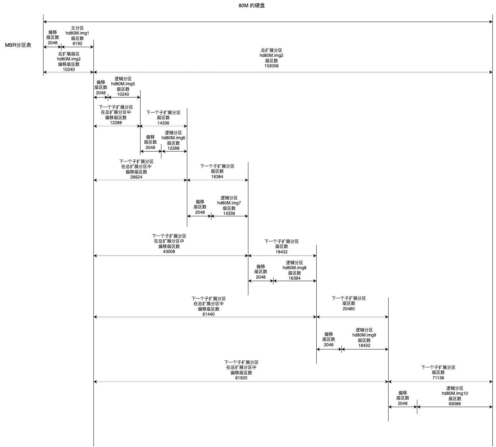

#### 1. 获取安装的磁盘数

在物理地址 `0x475` 处存储着主机上安装的硬盘的数量，它是由 BIOS 检测并写入的。因此当我们使用 bochs 配置好磁盘，准备调试的时候，可以先看看此处内存存储的磁盘数。如下即可查看

```
xp/b 0x475
```

#### 2. 创建磁盘分区表

文件系统是运行在操作系统中的软件模块，是操作系统提供的一套管理磁盘文件读写的方法和数据组织、存储形式。他的管理对象是文件，管辖范围是分区，因此他建立在分区的基础上，每个分区都可以有不同的文件系统。

分区：是由多个编号连续的柱面组成，因此分区在物理上的表现是由某段范围内的所有柱面组成的通心环。分区不能垮柱面，一个柱面只属于一个分区，分区的起始和终止都落在完整的柱面上。分区大小等于“每柱面上的扇区数”乘以“柱面数”。

```
磁盘容量 = 单片容量 * 磁头数
单片容量 = 每磁道扇区数 * 磁道数 * 512字节
因为 磁道数 等于 柱面数，因此
磁盘容量 = 每磁道扇区数 * 柱面数 * 512字节 * 磁头数
```

一般情况下，每磁道扇区数都是 63，扇区大小都是 512，柱面数和磁头数取决于实际配置。因此：
```
柱面数 * 磁头数 = 硬盘容量 / 63 / 512
那么，假如磁盘容量为 80M，柱面数和磁头数就可以选择：162和16、324和8、216和12 等
```

每个分区都有“描述符”来描述分区本身所在硬盘上的起止界限等信息，在硬盘的 MBR 中有个 64 字节“固定大小”的数据结构，称为“分区表”。分区表的每个表项大小是 16 字节，因此分区表可以容纳 4 个表项，这也就是硬盘仅支持 4 个分区的原因。

分区表的长度并不是由结构本身限制，而是由所在的位置限制，他必须存在于 MBR 引导扇区或 EBR 引导扇区中。在这 512 字节中，前 446 字节是硬盘的参数和引导程序，然后才是 64 字节的分区表，最后是 2 字节的魔数 `0x55aa`。

在分区描述符中有属性是文件系统 id，表示文件系统的类型。为了支持更多的分区，专门增加一种属性值（id 为5），用来表示该分区可被再次划分成更多的子分区，这就是**逻辑分区**。

这 4 个分区都可以作为扩展分区（逻辑分区），扩展分区是可选项，可以没有，最多只有 1 个。如果有，其他 3 个区称为主分区。1 个扩展分区理论上可以划分出任意多的子扩展分区。但一般硬件有限制，比如 ide 硬盘只支持 63 个分区，scsi 硬盘只支持 15 个分区。

可以使用 fdisk 来设置硬盘的分区。

#### 3. 磁盘分区表浅析

磁盘分区表（`Disk Partition Table`）简称 DPT。有 4 个表项。是由多个分区元信息组成的表，表中每一个表项都对应一个分区，主要记录各分区的起始扇区地址，大小界限等

最初的磁盘分区表位于 MBR 引导扇区，这 512 字节内容由 3 部分组成：

```
0 - 0x1BD  总共 446 字节，存放主引导记录MBR
0x1BE - 0x1FD   总共 64 字节，存放磁盘分区表
0x55,0xaa  这两字节，存放魔数
```

分区需要占用完整的柱面，但 MBR 引导扇区位于 0 盘 0 道 1 扇区，因此 MBR 所在的磁道就不能划入分区了，因此分区起始地址要偏移磁盘 1 个磁道的大小。并且 0 磁道剩余的 63 个扇区操作系统一般不会去用他了。

**如何设计扩展分区的分区表呢？**

既要兼容固定长度为 4 个分区的分区表，又要突破固定分区数的限制。将这个扩展分区视为总扩展分区，将他划分成多个子扩展分区，每个子扩展分区“在逻辑上”相当于硬盘，因此每个子扩展分区都可以有一个分区表。虽然每个分区表长度为4，但允许有无限多个分区表。扩展分区表采用链式结构。

每个子扩展分区的空间并不是只有逻辑分区，在每个子扩展分区中最开始的扇区（称为 EBR 引导扇区）用于存储此子扩展分区中的分区表。他的结构和 MBR 一致。因此那个磁道剩余的扇区也不会再使用，其余部分才会作为存储数据的逻辑分区。MBR 也即扩展引导记录。

每个子扩展分区都有一个 EBR，EBR 中分区表的第一分区表项用来描述所包含的逻辑分区的元信息，第二分区表项用来描述下一个子扩展分区的地址，第三、四表项未用到。值得一提的是，这个第一分区表项指向该逻辑分区的最开始的扇区，此扇区称为操作系统引导扇区，即 OBR 引导扇区。

如下是分区表项结构：



注意：MBR、EBR 不属于分区之内，不属于操作系统管理的范围。而 OBR 引导扇区位于分区（主分区和逻辑分区）最开始的扇区，属于操作系统管理的范围。因此操作系统通常往 OBR 引导扇区中添加内核加载器的代码，供 MBR 调用以实现操作系统的自举，总之，OBR 引导扇区中绝不包含分区表。

总结一下：总扩展分区被直接拆分成多个子扩展分区，子扩展分区又被拆分成 EBR引导扇区、空闲扇区、逻辑分区三部分。

#### 4. 分区实验

我们创建了一块 80M 的磁盘：` bximage -q -func="create" -hd=80 -imgmode="flat" -sectsize=512  hd80M.img`

然后进行分区：`echo "n\np\n1\n\n+4M\nn\ne\n2\n\n\nn\n\n+5M\nn\n\n+6M\nn\n\n+7M\nn\n\n+8M\nn\n\n+9M\nn\n\n\nw\n" | fdisk ./hd80M.img`

查看分区：

```
Device        Boot Start    End Sectors  Size Id Type
./hd80M.img1        2048  10239    8192    4M 83 Linux
./hd80M.img2       10240 163295  153056 74.8M  5 Extended
./hd80M.img5       12288  22527   10240    5M 83 Linux
./hd80M.img6       24576  36863   12288    6M 83 Linux
./hd80M.img7       38912  53247   14336    7M 83 Linux
./hd80M.img8       55296  71679   16384    8M 83 Linux
./hd80M.img9       73728  92159   18432    9M 83 Linux
./hd80M.img10      94208 163295   69088 33.8M 83 Linux
```

其中 `./hd80M.img1 ` 是主分区，`./hd80M.img2` 是总扩展分区，其他的是子扩展分区。

因此，我们看此物理磁盘第一个扇区的分区表，分区表 64 字节，存放在 0x1BE - 0x1FD

```
# xxd -a -s 0 -l 512 hd80M.img
00000000: 0000 0000 0000 0000 0000 0000 0000 0000  ................
*
000001b0: 0000 0000 0000 0000 6110 f6b4 0000 0020  ........a......
000001c0: 2100 83a2 2200 0008 0000 0020 0000 00a2  !..."...... ....
000001d0: 2300 0529 3f0a 0028 0000 e055 0200 0000  #..)?..(...U....
000001e0: 0000 0000 0000 0000 0000 0000 0000 0000  ................
000001f0: 0000 0000 0000 0000 0000 0000 0000 55aa  ..............U.
```

分区表项占用 16 字节，因此：

- 第一个分区表项是：`0020 2100 83a2 2200 0008 0000 0020 0000`
- 第二个分区表项是：`00a2 2300 0529 3f0a 0028 0000 e055 0200 `

第一个分区表项是主分区，分区类型是 `0x83`，扇区数 `0x 0000 2000 => 8192`。偏移扇区数是：`0x0000 0800 => 2048`

第二个分区表项是总扩展分区，分区类型是 `0x05`，扇区数 `0x 0002 55e0 => 153056`。偏移扇区数是：`0x0000 2800 => 10240`。就是对应到 `./hd80M.img2`，他就是总扩展分区。

第三、四个分区表项未使用，所以全为 0。

好，如上是 MBR 引导扇区的分区表，接下来再来解析扩展分区的分区表。扩展分区中的所有分区表被组织成单向链表。通过总扩展分区的偏移扇区数，计算出总扩展分区中第一个扇区位置：`0x2800 * 512 => 0x500000`，这个扇区就是总扩展分区的分区表。

```
xxd -a -s 0x500000 -l 512 hd80M.img
00500000: 0000 0000 0000 0000 0000 0000 0000 0000  ................
*
005001b0: 0000 0000 0000 0000 0000 0000 0000 00c3  ................
005001c0: 0400 8366 2501 0008 0000 0028 0000 0066  ...f%......(...f
005001d0: 2601 054b 0902 0030 0000 0038 0000 0000  &..K...0...8....
005001e0: 0000 0000 0000 0000 0000 0000 0000 0000  ................
005001f0: 0000 0000 0000 0000 0000 0000 0000 55aa  ..............U.
```

我们知道，扩展分区的分区表，第一个分区表项是用来描述所包含的逻辑分区的元信息，第二分区表项用来描述下一个子扩展分区的地址，第三、四表项未用到。分区表项位置：`0x500000 + 446 => 0x5001be` 因此：

- 扩展分区的分区表中，第一个分区表项是：`0x00c3 0400 8366 2501 0008 0000 0028 0000`。偏移扇区数：`0x0000 0800 => 2048`。扇区数：`0x0000 2800 => 10240`，对应到 `./hd80M.img5`  分区。他就是子扩展分区，又称为逻辑分区。
- 扩展分区的分区表中，第二个分区表项是：`0x0066 2601 054b 0902 0030 0000 0038 0000 `。偏移扇区数：`0x0000 3000 => 12288`。扇区数：`0x0000 3800 => 14336`。

**注意：子扩展分区是在总扩展分区中创建的，子扩展分区的偏移扇区理应以总扩展分区的绝对扇区 LBA 地址为基准，因此，子扩展分区的绝对扇区 LBA 地址 = 总扩展分区绝对扇区 LBA 地址 + 子扩展分区的偏移地址**。分区起始偏移扇区是一个相对量。

我们通过这个信息来看下一个子扩展分区的地址，绝对偏移地址：`(0x2800 + 0x3000) * 512 => 0xb0 0000`

```
# xxd -a -s 0xb00000 -l 512  hd80M.img
00b00000: 0000 0000 0000 0000 0000 0000 0000 0000  ................
*
00b001b0: 0000 0000 0000 0000 0000 0000 0000 0087  ................
00b001c0: 0701 834b 0902 0008 0000 0030 0000 004b  ...K.......0...K
00b001d0: 0a02 0550 0d03 0068 0000 0040 0000 0000  ...P...h...@....
00b001e0: 0000 0000 0000 0000 0000 0000 0000 0000  ................
00b001f0: 0000 0000 0000 0000 0000 0000 0000 55aa  ..............U.
```

第二个子扩展分区的分区表如上，我们来看分区表项，同样的，第三、四分区表项不使用

- 第一个分区表项：`0x0087 0701 834b 0902 0008 0000 0030 0000`。偏移扇区数：`0x0000 0800 => 2048`，扇区数：`0x0000 3000 => 12288`。对应到子扩展分区 `./hd80M.img6`
- 第二个分区表项：`0x004b 0a02 0550 0d03 0068 0000 0040 0000 `。分区类型：`0x05`，偏移扇区数：`0x0000 6800 => 26624`，扇区数：`0x0000 4000 => 16384`。

好，我们继续计算下一个子扩展分区的地址，绝对偏移地址：`(0x2800 + 0x6800) * 512 => 0x120 0000 `。

```
# xxd -a -s 0x1200000 -l 512  hd80M.img
01200000: 0000 0000 0000 0000 0000 0000 0000 0000  ................
*
012001b0: 0000 0000 0000 0000 0000 0000 0000 006b  ...............k
012001c0: 2a02 8350 0d03 0008 0000 0038 0000 0050  *..P.......8...P
012001d0: 0e03 0575 3104 00a8 0000 0048 0000 0000  ...u1......H....
012001e0: 0000 0000 0000 0000 0000 0000 0000 0000  ................
012001f0: 0000 0000 0000 0000 0000 0000 0000 55aa  ..............U.
```

第三个子扩展分区的分区表如上：

- 第一个分区表项：`0x006b 2a02 8350 0d03 0008 0000 0038 0000`。偏移扇区数：`0x0000 0800 => 2048`，扇区数：`0x0000 3800 => 14336`。对应到子扩展分区 `./hd80M.img7`
- 第二个分区表项：`0x0050 0e03 0575 3104 00a8 0000 0048 0000`。偏移扇区数：`0x0000 a800 => 43008`，扇区数：`0x0000 4800 => 18432`

好，我们继续计算下一个子扩展分区的地址，绝对偏移地址：`(0x2800 + 0xa800) * 512 => 0x1a0 0000 `

```
# xxd -a -s 0x1a00000 -l 512  hd80M.img
01a00000: 0000 0000 0000 0000 0000 0000 0000 0000  ................
*
01a001b0: 0000 0000 0000 0000 0000 0000 0000 0070  ...............p
01a001c0: 2e03 8375 3104 0008 0000 0040 0000 0075  ...u1......@...u
01a001d0: 3204 05bb 3605 00f0 0000 0050 0000 0000  2...6......P....
01a001e0: 0000 0000 0000 0000 0000 0000 0000 0000  ................
01a001f0: 0000 0000 0000 0000 0000 0000 0000 55aa  ..............U.
```

第 4 个子扩展分区的分区表如上：

- 第一个分区表项：`0x0070 2e03 8375 3104 0008 0000 0040 0000`。偏移扇区数：`0x0000 0800 => 2048`，扇区数：`0x0000 4000 => 16384`。对应到子扩展分区 `./hd80M.img8`
- 第二个分区表项：`0x0075 3204 05bb 3605 00f0 0000 0050 0000 `。偏移扇区数：`0x0000 f000 => 61440`，扇区数：`0x0000 5000 => 20480`

继续计算下一个子扩展分区的地址，绝对偏移地址：`(0x2800 + 0xf000) * 512 => 0x230 0000 `

```
# xxd -a -s 0x2300000 -l 512  hd80M.img
02300000: 0000 0000 0000 0000 0000 0000 0000 0000  ................
*
023001b0: 0000 0000 0000 0000 0000 0000 0000 0096  ................
023001c0: 1304 83bb 3605 0008 0000 0048 0000 00bb  ....6......H....
023001d0: 3705 0529 3f0a 0040 0100 e015 0100 0000  7..)?..@........
023001e0: 0000 0000 0000 0000 0000 0000 0000 0000  ................
023001f0: 0000 0000 0000 0000 0000 0000 0000 55aa  ..............U.
```

第 5 个子扩展分区的分区表如上：

- 第一个分区表项：`0x0096 1304 83bb 3605 0008 0000 0048 0000 `。偏移扇区数：`0x0000 0800 => 2048`，扇区数：`0x0000 4800 => 18432`。对应到的子分区：`./hd80M.img9`
- 第二个分区表项：`0x00bb 3705 0529 3f0a 0040 0100 e015 0100`。偏移扇区数：`0x0001 4000 => 81920`，扇区数：`0x0001 15e0 => 71136`

继续计算下一个子扩展分区的地址，绝对偏移地址：`(0x2800 + 0x14000) * 512 => 0x2d0 0000`

```
# xxd -a -s 0x2d00000 -l 512  hd80M.img
02d00000: 0000 0000 0000 0000 0000 0000 0000 0000  ................
*
02d001b0: 0000 0000 0000 0000 0000 0000 0000 00dc  ................
02d001c0: 1805 8329 3f0a 0008 0000 e00d 0100 0000  ...)?...........
02d001d0: 0000 0000 0000 0000 0000 0000 0000 0000  ................
02d001e0: 0000 0000 0000 0000 0000 0000 0000 0000  ................
02d001f0: 0000 0000 0000 0000 0000 0000 0000 55aa  ..............U.
```

第 6 个子扩展分区的分区表如上：

- 第一个分区表项：`0x00dc 1805 8329 3f0a 0008 0000 e00d 0100`。偏移扇区数：`0x0000 0800 => 2048`，扇区数：`0x0001 0de0 => 69088`。对应的子区：`./hd80M.img10 `
- 由于后续再无分区，所以没有后续分区表项

此时，我们拆分了所有的分区表。接下来我们以一张图来展示这块物理硬盘，分区后的布局图：




