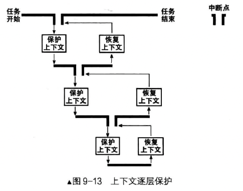
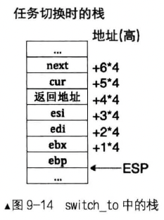

**如何得到当前线程的 PCB 地址**？各个线程所用的 0 级栈都是在自己的 PCB 中，因此取当前栈指针的高 20 位作为当前运行线程的 PCB。因为 PCB 有一页，PCB 的地址都对齐到 4KB 上。

**线程执行用户线程函数时，一定要开中断？**他是任务调度的保证，我们的任务调度机制基于时钟中断，由时钟中断这种 “不可抗力” 来中断所有任务的执行，借此将控制权交到内核手中，由内核的任务调度器考虑将处理器使用权发放到某个任务的手中，下次中断再发生时，权利将再被回收。这样保证了操作系统不会被 “架空”，而且保证所有任务都有运行的机会。**什么时候关的中断呢？**线程首次运行是由时钟中断处理函数调用任务调度器完成的，进入中断后处理器会自动关中断，因此在执行用户线程函数前要打开中断。

### 一、调度器的原理实现

调度器的主要任务就是读写就绪队列，增删里面的节点，节点是线程 PCB 中的 general_tag，相当于线程的 PCB。

线程每次在处理器上的执行时间是由其 ticks 决定的，我们在初始化线程的时候，已经将线程 PCB 中的 ticks 赋值为 prio，优先级越高，ticks 越大。每发生一次时钟中断，时钟中断的处理程序便将当前运行的线程的 ticks 减一。当 ticks 为 0 时，时钟的中断处理程序调用调度器 schedule，也就是把当前线程换下处理器，让调度器选择另一个线程上处理器。

我们的调度机制是 “轮询调度”，称为 RR（Round-Robin Scheduling）。

调度器 schedule 并不仅由时钟中断处理程序来调用，可能还有其他函数调用的情况，比如：thread_block（线程阻塞函数）。因此，在 schedule 中要判断当前线程是出于什么缘由被换下？（时间片到期、被阻塞）其实就是查看线程的状态

- 如果线程的状态为 `RUNNING` 状态，说明时间片到期了，将其 ticks 重新赋值为它的优先级，将其状态改为 `READY`，并将其加入到就绪队列的末尾
- 如果为其他状态，不需要任何操作，因为调度器是从就绪队列中取出下一个线程，而当前运行的线程并不在就绪队列中

调度器按照队列先进先出的顺序，把就绪队列中的第一个节点作为下一个要运行的新线程，将该线程的状态置为 `RUNNING`，之后通过 switch_to 函数将新线程的寄存器环境恢复，这样新线程便可以执行。

因此，完整的调度过程需要三部分。分别是：注册时钟中断处理函数、调度器调度、任务切换函数 switch_to

### 二、任务切换

任务在执行过程中会执行用户代码和内核代码，当 CPU 处于低特权级下执行用户代码时称为用户态；当 CPU 进入高特权级执行内核代码时称为内核态。所以无论是执行用户代码，还是执行内核代码，这些代码都属于完整的程序，即属于当前任务。

任务与任务的区别在于执行流有一整套的上下文资源，这包括寄存器映像、地址空间、IO位图等。拥有这些资源才称得上是任务。因此，CPU 只有被新的上下文资源重新装载后，当前任务才被替换为新的任务，这才叫任务切换。

当任务进入内核态时，其上下文资源并未完全替换，只是执行了高特权级的代码。

为什么要保存上下文？操作系统是由中断驱动的，为了在中断处理完成后能够恢复任务原有的执行路径，必须在执行流被改变前，将任务的上下文保护好。

任务调度是由时钟中断发起，由中断处理程序调用 switch_to 函数实现



如上图，假设当前任务在中断发生前所处的执行流属于第一层，受时钟中断的影响，处理器会进入中断处理程序，这使当前的任务执行流第一次被改变，因此在进入中断时，我们要保护好第一层的上下文，即中断前的任务状态。之后在内核中执行中断处理程序，这属于第二层执行流。当中断处理程序调用任务切换函数 switch_to 时，当前的中断处理程序又要被中断，因此要保护好第二层的上下文，即中断处理过程中的任务状态。

因此，我们系统中的任务调度，过程中需要保护好任务两层执行流的上下文，分两部分完成。

- 第一部分是进入中断时的保护，这保存的是任务的全部寄存器映像，也就是进入中断前任务所属第一层的状态，这些寄存器映像相当于任务中用户代码的上下文。这部分负责保护任务进入中断前的全部寄存器，目的是能让任务恢复到中断前。
- 第二部分是保护内核环境上下文，根据 ABI 规则（见概念部分 ABI 规则），除了 esp 外（已有调用规则保存在栈上了），只保护 esi、edi、ebx 和 ebp 这 4 个寄存器就行。这 4 个寄存器映像相当于任务中的内核代码的上下文，也就是第二层执行流，此部分只负责恢复第二层的执行流，即恢复为在内核的中断处理程序中继续执行的状态。也就是说，让任务恢复执行 在任务切换发生时 剩下的尚未执行的内核代码，保证顺利走到退出中断的出口，然后利用第一部分保护的寄存器环境彻底恢复任务。

有必要解释下 switch_to 函数做任务切换的过程

```
; 此函数接受两个参数，第一个参数是当前线程 cur，第二个参数是下一个上处理器的线程
; 此函数的功能是保存 cur 线程的寄存器映像，将下一个线程 next 的寄存器映像装载到处理器
global switch_to
switch_to:
    ; 栈中此处是返回地址
    ; 根据 ABI 原则，保护内核环境上下文，保护如下 4 个寄存器
    push esi
    push edi
    push ebx
    push ebp
    ; 得到栈中的参数 cur，cur = [esp + 20]
    mov eax, [esp + 20]
    ; 保存栈顶指针 esp。task_struct 的 self_kernel_stack 字段
    ; self_kernel_stack 在 task_struct 中的偏移为 0
    ; 所以直接往 thread 开头处存 4 字节即可
    mov [eax], esp

    ; --- 以上是备份当前线程的环境，以下是恢复下一个线程的环境 ---

    ; 得到栈中参数 next, next = [esp + 24]
    mov eax, [esp + 24]
    ; pcb 的第一个成员是 self_kernel_stack
    ; 用来记录 0 级栈顶指针，被换上 cpu 时用来恢复 0 级栈
    ; 0 级栈中保存了进程或者线程所有信息，包括 3 级栈指针
    mov esp, [eax]
    pop ebp
    pop ebx 
    pop edi 
    pop esi 
    ; 如果未由中断进入，第一次执行时会返回到 kernel_thread
    ret
```

在保存 esi、edi、ebx、ebp 这 4 个寄存器时，因为栈是从高地址向低地址扩展的，所以这 4 个 push 操作与线程栈 `struct thread_stack` 结构体的结构是逆序的。栈的情况如下：



在 PCB 结构中，第一个成员是 `self_kernel_stack`，用来记录每个线程自己的栈顶指针。任务在内核中的寄存器映像是保存在栈中的，任务在下次被调度运行时，还得把寄存器映像从栈中恢复，因此，为了恢复寄存器映像，先得知道寄存器映像被保存在那个栈中，也就是我们需要在切换前把当前的栈指针保存到某个地方，下次再被调度上处理器前，再从相同的地方恢复栈指针，将栈中的寄存器映像重新装载到处理器。

因此，

- 上述代码中 `mov eax, [esp+20]` 是为了获取栈中 cur 线程 PCB 结构的起始值。因为 self_kernel_stack 在 PCB 中偏移为 0，所以 `mov [eax], esp` 执行完，就将当前栈顶指针 esp 保存到了当前线程 PCB 中的 self_kernel_stack 成员中了。至此，当前线程的上下文环境保存完毕
- 上述代码 `mov eax, [esp+24]` 是为了获取栈中 next 线程 PCB 结构的起始值。之后，将 esp 指向 next 线程的 `self_kernel_stack` 。就可以找到 next 线程的栈，从而可以从栈中恢复之前保存过的寄存器映像。
- 后面的 pop 操作，获取到的是 next 线程的寄存器映像哈。最后的 ret 指令便将当前栈顶处的值作为返回地址加载到处理器的 eip 寄存器中，从而使 next 线程的代码恢复执行。
- 如果 next 线程之前没有执行过，是第一次执行，此时栈顶的值是函数 kernel_thread 的地址，这是由 thread_create 函数设置的，执行 ret 指令后处理器将去执行函数 kernel_thread。
- 如果 next 线程之前已经执行过了，这次是再次将其调度到处理器的话，此时栈顶的值是由调用函数 switch_to 的主调函数 schedule 留下的，这会继续执行 schedule 后面的流程。switch_to 是 schedule 的最后一句代码，并且 schedule 是 intr_timer_handler 中最后一句代码，因此会完成 intr_timer_handler，回到 kernel.s 中的 `jmp intr_exit`，从而恢复任务的全部寄存器映像，之后通过 iretd 指令退出中断，任务被完全彻底的恢复。