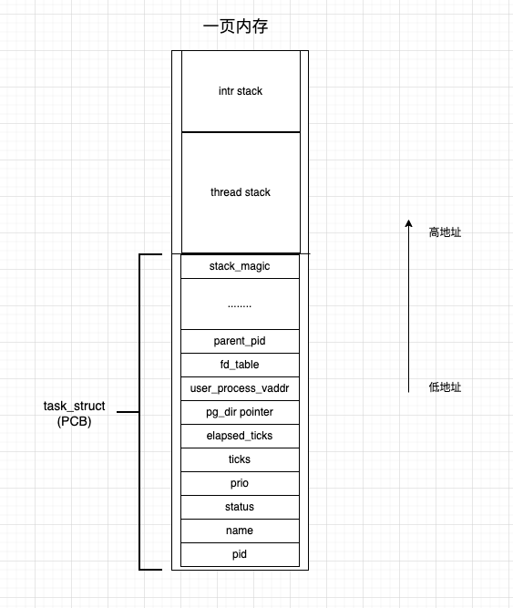

### 一、线程的实现

先在内核空间中申请一页内存（4KB），用线程 PCB 结构的指针，指向这块内存。

我们先来看看 PCB 结构都有哪些字段：

```
struct task_struct {
    // 内核线程所用的内核栈
    uint32_t* self_kernel_stack;
    pid_t pid;
    // 状态
    enum task_status status;
    char name[TASK_NAME_LEN];
    // 优先级
    uint8_t priority;
    // 每次在处理器上执行的时钟滴答数
    uint8_t ticks;
    // 此任务自从上 CPU 运行后至今占用了多少 cpu 滴答数
    // 任务运行了多久
    uint32_t elapsed_ticks;
    // 用于线程在一般队列中的节点（比如：就绪队列或者其他队列）
    struct list_elem general_tag;
    // 用于线程队列 thread_all_list 中的节点
    struct list_elem all_list_tag;
    // 进程自己页表的虚拟地址
    // 如果是线程，则此字段为 NULL
    uint32_t* pg_dir;
    // 用户进程的虚拟地址
    struct virtual_addr user_process_vaddr;
    // 用户进程内存块描述符
    struct mem_block_desc u_block_desc[DESC_CNT];
    // 已打开文件数组
    int32_t fd_table[MAX_FILES_OPEN_PER_PROC];
    // 进程所在的工作目录的 inode 编号
    uint32_t cwd_inode_nr;
    // 父进程 pid
    int16_t parent_pid;
    // 栈的边界标记，用于检测栈的溢出
    // 这个字段因为要作为边界标记，所以必须放在结构体的末尾
    // 我们的 PCB 和 0 级栈是在同一页中，栈位于页的顶端并向下发展
    // 因此担心压栈过程中会把 PCB 中的信息给覆盖，所以每次在线程或进程调度时要判断是否触及到了进程信息的边界
    // 也就是判断 stack_magic 的值是否为初始化的内容。其实 stack_magic 是一个魔数
    uint32_t stack_magic;
};
```

然后初始化 PCB，包括：

- 给线程设置一个 pid 或者 tid、设置线程名字、将线程的状态设置为运行状态
- 设置线程的优先级（用于线程在 CPU 上执行的时间片长度，优先级越高，执行的时间片越长）
- 设置线程的时间片，目前线程的优先级就是时间片
- 初始化线程在 0 特权级下所用的栈（在线程创建时，他被初始化为线程 PCB 的最顶端），将来线程在内核态下的任何栈操作都是用此 PCB 中的栈。操作为：`thread->self_kernel_stack = (uint32_t*)((uint32_t)pthread + PAGE_SIZE);`
- 初始化线程的标签，其实就是双向链表的节点。线程要被调度，就需要放到就绪队列（双向链表实现）中。还有一个全部线程队列（双向链表实现），存储所有线程（包括就绪的、阻塞的、正在执行的）。所以线程有两个标签。
- 设置页表，如果是线程，此值为空；如果是进程，此值是页表的虚拟地址。线程和进程最大的区别就是进程独享自己的地址空间，即进程有自己的页表，而线程共享所在进程的地址空间，即线程无页表。
- 设置魔数，魔数的位置在线程 PCB 信息的最边缘。如果出现 0 级特权栈溢出了，第一个被覆盖的就是这个魔数。因此用它来检测是否出现 0 特权级下的栈是否溢出

然后开始创建线程，我们需要初始化线程栈，将待执行的函数和参数放到线程栈中相应的位置。

- 预留线程所使用的中断栈。中断栈有两个作用：1. 线程进入中断后，中断代码会通过此栈来保存上下文；2. 用户进程的初始信息会放在中断栈。

  操作：`pthread->self_kernel_stack -= sizeof(struct intr_stack);`。操作完之后 self_kernel_stack 指针指向 PCB 中的中断栈下面的地址

- 预留线程栈，操作：`pthread->self_kernel_stack -= sizeof(struct thread_stack);`

  然后初始化线程栈结构中的内容。

  线程栈结构中 eip 指针指向一个函数 kernel_thread，内部做两件事情，开中断和执行用户线程函数。然后分别填充用户线程函数和函数参数。最后将 ebp、ebx、esi、edi 这 4 个寄存器初始化为 0，因为线程中函数尚未执行，在执行过程中才会有值。

最后开启线程，将 `thread->self_kernel_stack` 的值作为栈顶，此时 `thread->self_kernel_stack` 指向线程栈的最低处。接下来，使用 pop 指令将栈中数值弹入填充 ebp、ebx、edi、esi 四个寄存器。最后使用 ret 指令把栈顶的数据作为返回地址送上处理器的 EIP 寄存器。那么此时 EIP 寄存器指向的就是我们之前填充的 kernel_thread 函数，处理器就会去执行用户线程函数。

结构如下图：



