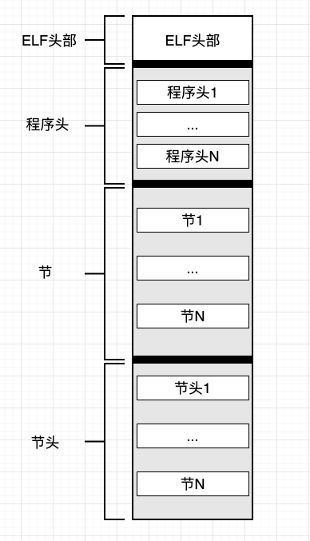

## 认识 ELF 文件格式（一）

前面用了两篇文章做引子，简单说明了二进制的生成过程，以及二进制的运行过程。我们接下来进行我们的重点话题，即 ELF 文件的格式，接下来我们一起来了解 ELF 文件的内容格式。

ELF 文件格式不仅针对于可执行文件，还有可重定位文件、共享库、以及核心转储（Core 文件）。

我们主要分享 64 位 ELF 文件格式，他是 32 位的 ELF 文件格式是比较相似的，主要区别也就是某些头部字段和其他数据结构的大小和顺序。

ELF 文件格式实际上可以划分为 4 个模块：ELF 头部、多个程序头、多个节、每个节对应的节头。如下：



接下来我们详细的说明每个部位的组成。

### 一、ELF 头部

每个 ELF 文件都是从 ELF 头部开始，他是一系列结构化的字节。主要告诉我们这是一个什么样的 ELF 文件。我们直接来看他的格式。他的定义在 `/usr/include/elf.h` 文件中。

```c
/* Type for a 16-bit quantity.  */
typedef uint16_t Elf32_Half;
typedef uint16_t Elf64_Half;

/* Types for signed and unsigned 32-bit quantities.  */
typedef uint32_t Elf32_Word;
typedef	int32_t  Elf32_Sword;
typedef uint32_t Elf64_Word;
typedef	int32_t  Elf64_Sword;

/* Types for signed and unsigned 64-bit quantities.  */
typedef uint64_t Elf32_Xword;
typedef	int64_t  Elf32_Sxword;
typedef uint64_t Elf64_Xword;
typedef	int64_t  Elf64_Sxword;

/* Type of addresses.  */
typedef uint32_t Elf32_Addr;
typedef uint64_t Elf64_Addr;

/* Type of file offsets.  */
typedef uint32_t Elf32_Off;
typedef uint64_t Elf64_Off;

/* Type for section indices, which are 16-bit quantities.  */
typedef uint16_t Elf32_Section;
typedef uint16_t Elf64_Section;

/* Type for version symbol information.  */
typedef Elf32_Half Elf32_Versym;
typedef Elf64_Half Elf64_Versym;

typedef struct
{
  unsigned char	e_ident[EI_NIDENT];	/* Magic number and other info */
  Elf64_Half	e_type;			/* Object file type */
  Elf64_Half	e_machine;		/* Architecture */
  Elf64_Word	e_version;		/* Object file version */
  Elf64_Addr	e_entry;		/* Entry point virtual address */
  Elf64_Off	e_phoff;		/* Program header table file offset */
  Elf64_Off	e_shoff;		/* Section header table file offset */
  Elf64_Word	e_flags;		/* Processor-specific flags */
  Elf64_Half	e_ehsize;		/* ELF header size in bytes */
  Elf64_Half	e_phentsize;		/* Program header table entry size */
  Elf64_Half	e_phnum;		/* Program header table entry count */
  Elf64_Half	e_shentsize;		/* Section header table entry size */
  Elf64_Half	e_shnum;		/* Section header table entry count */
  Elf64_Half	e_shstrndx;		/* Section header string table index */
} Elf64_Ehdr;
```

我们来解释一下这个结构，其中这些字段的类型是一个 typedef。可自行查看定义。

#### 1. e_ident

他是一个 16 字节的数组。

这个数组的前 4 个字节为魔数。分别为：0x7F、字母 E、字母 L、字母 F。使用魔数可以快速得知我们处理的是 ELF 文件

接下来的 12 字节，分别为 `EI_CLASS、EI_DATA、EI_VERSION、EI_OSABI、EI_ABIVERSION、EI_PAD`。其中 `EI_PAD` 包含 7 个字节，其他的都只是 1 个字节。

- `EI_CLASS`：表示该 ELF 文件是 32 位还是 64 位的体系结构。如果是 32 位的，会被设置为 1，64 位会被设置为 2。
- `EI_DATA`：表示该 ELF 文件的字节序。值为 1 表示小端字节序，值为 2 表示大端字节序。字节序也就是多字节值在内存中是以最低有效字节优化（小端），还是以最高有效字节优先（大端）。
- `EI_VERSION`：表示 ELF 的规范版本，当前只有一个有效值为 1。
- `EI_OSABI`：表示应用程序二进制接口（Application Binary Interface，ABI）和操纵系统（Operating System，OS）的信息。如果 `EI_OSABI` 字节设置为非零，则意味着在 ELF 文件中会使用一些 ABI 或者 OS 的具体扩展名。这可能会改变 ELF 文件中某些字段的含义，也可能表示存在非标准节。默认值为零，表示该二进制文件以 `UNIX System V ABI` 为目标。
- `EI_ABIVERSION`：表示 `EI_OSABI` 字节指定的 ABI 的具体版本。通常为零。
- `EI_PAD`：有 7 个字节，这些字节作为保留，目前默认填充为零。

好，我们使用 readelf 工具来看看 ELF 文件的 e_ident 数组。还是我们之前的 “hello world” 程序生成的二进制文件。

```shell
 # readelf -h a.out
ELF Header:
  Magic:   7f 45 4c 46 02 01 01 00 00 00 00 00 00 00 00 00
  Class:                             ELF64
  Data:                              2's complement, little endian
  Version:                           1 (current)
  OS/ABI:                            UNIX - System V
  ABI Version:                       0
  Type:                              EXEC (Executable file)
  Machine:                           Advanced Micro Devices X86-64
  Version:                           0x1
  Entry point address:               0x530
  Start of program headers:          64 (bytes into file)
  Start of section headers:          6440 (bytes into file)
  Flags:                             0x0
  Size of this header:               64 (bytes)
  Size of program headers:           56 (bytes)
  Number of program headers:         9
  Size of section headers:           64 (bytes)
  Number of section headers:         29
  Section header string table index: 28
```

- 我们看到 4 个字节的魔数，包括：`0x7f`，接下来 `0x45` 是字母 E 的 ASCII 值，`0x4c` 是字母 L 的 ASCII 值，`0x46` 是字母 F 的 ASCII 值。
- 接下来的 `0x02` 表示 `EI_CLASS` ，代表是 64 位体系结构
- 接下来的 `0x01` 是 `EI_DATA`，代表是小端字节序
- 接下来是 `0x01` 是 `EI_VERSION`，代表是 ELF 的版本，默认为 1
- `EI_OSABI` 和 `EI_ABIVERSION` 使用的默认值，默认都为 0
- `EI_PAD` 这 7 个字节作为保留，填充的都为 0

#### 2. e_type

占 2 个字节，`e_type` 字段指定了 ELF 文件的类型。有如下几种常见的类型

- `ET_REL`：值为 1，表示可重定位文件
- `EI_EXEC`：值为 2，表示可执行二进制文件
- `ET_DYN`：值为 3，表示动态库，也称为共享库

#### 3. e_machine

占 2 个字节，表示机器的体系结构，也是该 ELF 文件的平台属性，比如：`Advanced Micro Devices X86-64` 表示该 ELF 文件只能在 x86-64 的机器上使用。

- `EM_X86_64`：x86-64 的机器上
- `EM_386`：表示 Intel x86，也就是 32 位的 x86 机器上
- `EM_ARM`：表示 arm 机器

#### 4. e_version

这个字段的作用和 `e_ident` 数组中的 `EI_VERSION` 字节的作用相同。他表示创建二进制文件时使用的 ELF 版本规范。占用 4 个字节，但只有一个默认值，且默认值为 1。

#### 5. e_entry

这个字段表示二进制文件的入口点，这是一个虚拟地址。这里也是解释器（`ld-linux.so`）将二进制文件加载到虚拟内存后转移控制权的地方。

#### 6. e_phoff

这个字段表示**程序头**在 ELF 文件中偏移。我们知道，ELF 文件可能会有多个程序头，这个字段表示第一个程序头相对于 ELF 文件的偏移量。

这个偏移量可以设置为零，表示该 ELF 文件不包含程序头。

#### 7. e_shoff

这个字段表示**节头**在 ELF 文件中的偏移。同样的，ELF 文件可能会有多个节头，这个字段表示第一个节头相对于 ELF 文件的偏移量，同样的，这个偏移量可以设置为零，表示该 ELF 文件不包含节头。

#### 8. e_flags

这个字段用来标识 ELF 文件的平台属性。对于 x86 平台的 ELF 文件，这个字段通常被设置为零。

#### 9. e_ehsize

这个字段指定 ELF 文件头部的大小，单位是字节。我们从结构体 `Elf64_Ehdr` 可以看出，对于 64 位的 x86 的 ELF 文件，ELF 头部大小始终为 64 字节。

#### 10. e_phentsize 和 e_phnum

这两个字段分别表示 ELF 文件中程序头的大小和程序头的个数。前面介绍的 `e_phoff` 表示程序头在 ELF 文件中的偏移。现在这三个字段，可以让我们确定关于程序头的所有的信息。一个 ELF 文件中每个程序头的大小都是一致的。

#### 11. e_shentsize 和 e_shnum

这两个字段分别表示 ELF 文件中节头的大小和节头的个数。前面介绍的 `e_shoff` 表示节头在 ELF 文件中的偏移。现在这三个字段可以让我们确定关于节头的所有信息。同样的，一个 ELF 文件中每个节头的大小都是一致的。

#### 12. e_shstrndx

ELF 文件中有一个节是特殊字符串表，这个特殊字符串表中存储的是所有节的名称。特殊字符串表是一个节，这个节有他自己的节头。我们知道，ELF 中多个节头是以数组排列的形式放在 ELF 文件中的。那么 `e_shstrndx` 表示的是特殊字符串表（节）对应的节头，在所有节头中的位置，或者说索引。

这个特殊字符串表我们后面会详细说到。

### 二、小结

好！以上我们把 ELF 头部的所有字段说完了。我们在这里声明一下，可能不同的书籍会将以上的一些名词翻译成其他，大家要掌握他的原理即可，不要过分纠结不同的名次。

比如：Section：在本篇文章我将其翻译成 节。不过他还有段的意思等等。所以我们明白这个意思即可，不要纠结

可以通过 `readelf` 工具尝试自己解析一下 Linux 二进制文件、共享库文件。看看有什么不同，以及各个字段表示的含义。
