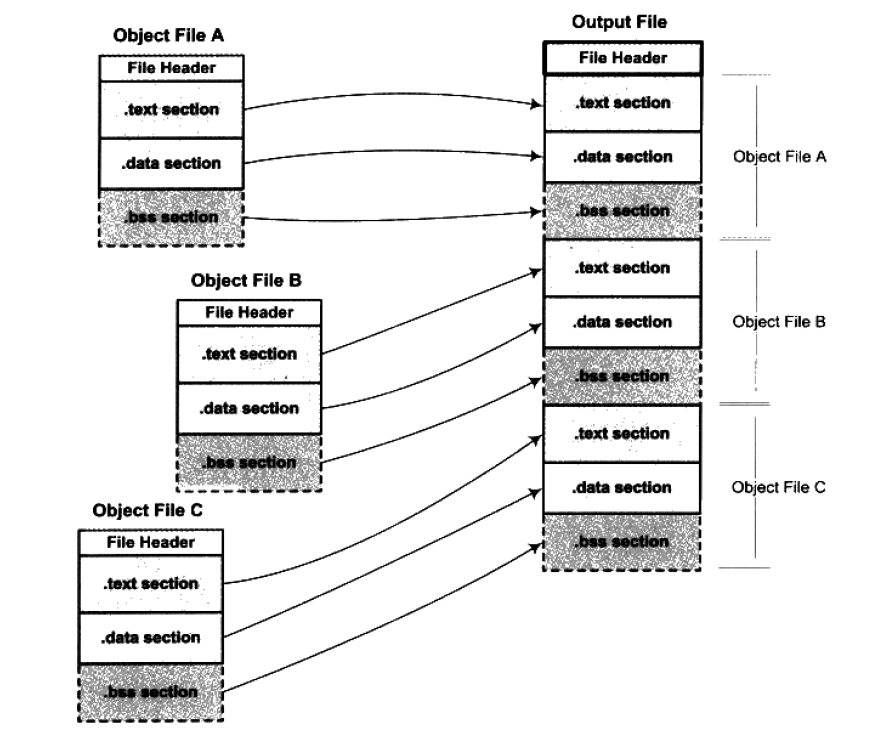

本篇内容主要分析静态链接的概念、原理，以及对应的节，以及这些节的内容。

## 一、链接的由来

比如我们有一个"hello world" 程序，如下：

```c
#include <stdio.h>

int main() {
    printf("hello world\n");
    return 0;
}
```

我们进行编译：`gcc main_03.c -fno-builtin -c -o main_03.o   `  生成 `main_03.o` 这个 ELF 文件。 使用 `-fno-builtin` 是为了禁用内联函数的优化，避免 printf 被优化成 puts。

```
# nm main_03.o
                 U _GLOBAL_OFFSET_TABLE_
0000000000000000 T main
                 U printf
```

然后我们使用 Linux 下的 nm 工具来查看，发现 printf 函数的状态为 U。代表：`"U" The symbol is undefined.` 这个符号没有被定义。

我们知道我们在编译的时候，程序模块 `a.c` 如果要使用其他模块的函数，比如 printf 函数，我们需要知道 printf 函数的地址，但是由于每个模块都是单独编译的，编译器在编译的时候无法得知 printf 函数的地址，因此暂时先将这个 printf 函数搁置。我们刚才看到对于编译成的 `.o` 文件，体现在符号的状态上就是符号未定义。

因此我们知道，我们需要对外部模块的函数、或变量的地址进行修正，肯定不能人工修正，于是就有链接过程。

链接是指在计算机程序的各模块之间传递参数和控制命令，并把它们组成一个可执行的整体的过程。在编写程序的时候，程序员把每个源代码模块独立的进行编译，然后按照需要将它们组装起来，这个组装模块的过程就是链接。这一过程就好像拼图一样，各个模块间依靠符号来通信，定义符号的模块多出一块区域，引用该符号的模块刚好少了那一块区域，两者拼接，完美组合。

## 二、静态链接

对于链接器来说，整个链接过程中，就是将几个输入目标文件加工后合并成一个输出文件。那么可执行文件中的代码段和数据段都是由输入的目标文件中合并而来的。现代的链接器一般采用两步链接的方法：

- 第一步，空间与地址分配。扫描所有的输入目标文件，并且获得他们的各个段的长度，属性和位置，并且将输入的目标文件中的符号表中所有符号定义和符号引用收集起来，统一放到一个全局符号表。这一步中，链接器将能够获得所有输入目标文件的段长度，并且将他们合并，计算出输出文件中各个段合并后的长度与位置，并建立映射关系。
- 第二步，符号解析与重定位。使用第一步收集到的所有信息，读取输入文件中段的数据、重定位信息，并且进行符号解析与重定位、调整代码中的地址等

### 1. 空间与地址的分配

现代的链接器采用将相似性质的段合并到一起，比如将所有输入文件的 “.text” 合并到输出文件的 “.text” 段。



如上图，我们可以看到 “.bss” 段在目标文件和可执行文件中并不占用文件的空间，但是他在装载时占用地址空间。所以链接器在合并各个段的同时，也将“.bss” 段合并，并且分配虚拟空间。

链接器为目标文件分配地址和空间，这里的地址和空间有两层含义：

- 在输出的可执行文件中的空间
- 在装载后的虚拟地址中的虚拟地址空间

对于有实际数据的段，比如 “.text” 和 ".data" 段来说，他们在文件中和虚拟地址中都要分配空间，因为他们在这两者中都存在；对于 “.bss” 这样的段来说，分配空间的意义只局限于虚拟地址空间，因为他们在文件中并没有内容。

我们下面举一个例子来看一下 “.text” 段和 “.data” 段合并的过程。假设有 a.c 和 b.c 这两个文件

a.c 文件

```
extern int shared;

int main() {
    int a = 100;
    swap(&a, &shared);
}
```

b.c 文件

```
int shared = 1;

void swap(int* a, int* b) {
    *a ^= *b ^= *a ^= *b;
}
```

我们分别编译 a.c 和 b.c。然后查看 a.o、b.o、ab 的代码段与数据段。使用如下命令

```
gcc a.c -c -o a.o -m32 -fno-stack-protector
gcc b.c -c -o b.o -m32 -fno-stack-protector
ld a.o b.o -e main -o ab -m elf_i386
objdump -h a.o > objdump_a.txt
objdump -h b.o > objdump_b.txt
objdump -h ab > objdump_ab.txt
```

我们查看链接前后 ".text"段和 “.data” 段的属性变化：

```
a.o
Idx Name          Size      VMA       LMA       File off  Algn
  1 .text         0000004a  00000000  00000000  0000003c  2**0
                  CONTENTS, ALLOC, LOAD, RELOC, READONLY, CODE
  2 .data         00000000  00000000  00000000  00000086  2**0
                  CONTENTS, ALLOC, LOAD, DATA
                  
b.o
Idx Name          Size      VMA       LMA       File off  Algn
  1 .text         00000043  00000000  00000000  0000003c  2**0
                  CONTENTS, ALLOC, LOAD, RELOC, READONLY, CODE
  2 .data         00000004  00000000  00000000  00000080  2**2
                  CONTENTS, ALLOC, LOAD, DATA
                  
二进制 ab
Idx Name          Size      VMA       LMA       File off  Algn
  0 .text         00000091  08049000  08049000  00001000  2**0
                  CONTENTS, ALLOC, LOAD, READONLY, CODE
  3 .data         00000004  0804c00c  0804c00c  0000300c  2**2
                  CONTENTS, ALLOC, LOAD, DATA
```

VMA（Virtual Memory Address）即虚拟地址，在链接之前，目标文件中的所有段的 VMA 都是 0，因为虚拟空间还没有被分配，所以默认为 0。在链接之后，可执行文件 ab 中的各个段都被分配到了相应的虚拟地址。

注意，在 Linux 下，ELF 可执行文件默认从地址 `0x08048000` 开始分配，所以我们 “.text” 段和 ".data" 段虚拟空间没有从 0 地址开始分配的。

当把输入文件中的各个段的虚拟地址确定后，链接器开始计算各个符号的虚拟地址。因为各个符号在段内的相对位置是固定的，所以链接器只需要给每个符号加上一个偏移量，就能使他们调整到正确的虚拟地址。

### 2. 符号解析与重定位

符号解析与重定位是静态链接的核心内容。

#### 2.1 重定位

我们在 a.c 文件中，有两个符号 swap 和 shared，编译器并不知道他们的地址。我们看如下的反汇编代码：

```
objdump -d a.o -M intel
00000000 <main>:
   0:	8d 4c 24 04          	lea    ecx,[esp+0x4]
   4:	83 e4 f0             	and    esp,0xfffffff0
   7:	ff 71 fc             	push   DWORD PTR [ecx-0x4]
   a:	55                   	push   ebp
   b:	89 e5                	mov    ebp,esp
   d:	53                   	push   ebx
   e:	51                   	push   ecx
   f:	83 ec 10             	sub    esp,0x10
  12:	e8 fc ff ff ff       	call   13 <main+0x13>
  17:	05 01 00 00 00       	add    eax,0x1
  1c:	c7 45 f4 64 00 00 00 	mov    DWORD PTR [ebp-0xc],0x64    // 给 a 赋值为 100
  23:	83 ec 08             	sub    esp,0x8
  26:	8b 90 00 00 00 00    	mov    edx,DWORD PTR [eax+0x0]    // 给 shared 的地址赋值为 0
  2c:	52                   	push   edx
  2d:	8d 55 f4             	lea    edx,[ebp-0xc]
  30:	52                   	push   edx
  31:	89 c3                	mov    ebx,eax
  33:	e8 fc ff ff ff       	call   34 <main+0x34>       // 给 swap 的地址暂时赋为 0xFFFF_FFFC
  38:	83 c4 10             	add    esp,0x10
  3b:	b8 00 00 00 00       	mov    eax,0x0
  40:	8d 65 f8             	lea    esp,[ebp-0x8]
  43:	59                   	pop    ecx
  44:	5b                   	pop    ebx
  45:	5d                   	pop    ebp
  46:	8d 61 fc             	lea    esp,[ecx-0x4]
  49:	c3                   	ret   
```

- 对于 shared，编译器就暂时把地址 0 看作是 “shared” 的地址
- 对于 swap 符号，编译器暂时用地址 `0xFFFF_FFFC` 看作是 “shared” 的地址

链接器在完成地址和空间分配之后就可以确定所有符号的虚拟地址了，那么链接器就可以根据符号的地址对每个需要重定位的指令进行地址修正。我们再来看输出程序 “ab” 的反汇编代码

```
08049000 <main>:
 ...
 8049017:	05 e9 2f 00 00       	add    eax,0x2fe9
 804901c:	c7 45 f4 64 00 00 00 	mov    DWORD PTR [ebp-0xc],0x64  // 给 a 赋值
 8049023:	83 ec 08             	sub    esp,0x8
 8049026:	c7 c2 0c c0 04 08    	mov    edx,0x804c00c   // 给 shared 赋值
 804902c:	52                   	push   edx
 804902d:	8d 55 f4             	lea    edx,[ebp-0xc]
 8049030:	52                   	push   edx
 8049031:	89 c3                	mov    ebx,eax
 8049033:	e8 16 00 00 00       	call   804904e <swap>    // 调用 swap 函数
 8049038:	83 c4 10             	add    esp,0x10
 ...
 
0804904e <swap>:
 ...
```

我们可以看到 shared 和 swap 符号都已经修正了。对于 swap 的修正，“call” 指令是一条“近址相对位移调用指令”，他后面跟的是调用指令的下一条指令的偏移量，计算：`0x8049038 + 0x16 = 0x0804904e`，恰好是 swap 函数的地址。

#### 2.2 重定位表

在 ELF 文件中，有一个或多个重定位表的结构专门用于保存与重定位相关的信息。对于可重定位的 ELF 文件来说，他必须包含有重定位表，用来描述如何修改相应段里的内容。对于每个要被重定位的 ELF 段都有一个对应的重定位表，而一个重定位表往往就是 ELF 文件的一个段，所以其实重定位表也被称为重定位段。

比如代码段 `.text` 如果有要被重定位的地方，那么会有一个相对应叫 `.rel.text` 的段保存了代码段的重定位表；如果代码段 `.data` 有被重定位的地方，就会有一个相对应叫 `.rel.data` 的段保存了数据段的重定位表。

```
# objdump -r a.o
RELOCATION RECORDS FOR [.text]:
OFFSET   TYPE              VALUE 
...
00000028 R_386_GOT32X      shared
00000034 R_386_PLT32       swap
```

`objdump -r` 可以查看 a.o 中需要重定位的地方，即 “a.o” 中所有引用到外部符号的地址。每个要被重定位的地方叫一个重定位入口。重定位入口的偏移表示该入口要被重定位的段中的位置，“RELOCATION RECORDS FOR [.text]” 表示这个重定位表是“代码段的重定位表”，所以偏移表示代码段中要被调整的位置。对照反汇编来看的话，这里的 0x28 和 0x34 分别就是代码段中 mov 指令和 call 指令的地址部分。

#### 2.3 符号解析

我们经常会看到链接时符号未定义

```
# ld a.o
ld: a.c:(.text+0x28): undefined reference to `shared'
ld: a.c:(.text+0x34): undefined reference to `swap'
```

最常见的一般都是链接时缺少了某个库，或者输入目标文件路径不正确，或者符号的声明和定义不一样。

其实重定义过程也伴随着符号的解析过程，每个目标文件都可能定义一些符号，也可能引用到定义在其他目标文件的符号。重定位过程中，每个重定位的入口都是对一个符号的引用，那么当链接器需要对某个符号的引用进行重定位时，他就要确定这个符号的目标地址。这时候链接器就会去查找由所有输入目标文件的符号表组成的全局符号表，找到相应的符号后进行重定位。

```
# readelf -s a.o
Symbol table '.symtab' contains 9 entries:
   Num:    Value  Size Type    Bind   Vis      Ndx Name
     0: 00000000     0 NOTYPE  LOCAL  DEFAULT  UND 
     1: 00000000     0 FILE    LOCAL  DEFAULT  ABS a.c
     2: 00000000     0 SECTION LOCAL  DEFAULT    2 .text
     ...
     4: 00000000    74 FUNC    GLOBAL DEFAULT    2 main
		 ...
     7: 00000000     0 NOTYPE  GLOBAL DEFAULT  UND shared
     8: 00000000     0 NOTYPE  GLOBAL DEFAULT  UND swap
```

如上，我们看到 shared 和 swap 符号都是 “UND”（undefined）类型，这种未定义的符号都是因为该目标文件中有关于他们的重定位项。所以在链接器扫描完所有的输入目标文件之后，所有这些未定义的符号都应该能够在全局符号表中找到，否则链接器就报符号未定义报错。

#### 2.4 指令修正方式

一般有“绝对寻址修正”、“相对寻址修正” 这两种方式

- 绝对寻址修正后的地址为该符号的实际地址
- 相对寻址修正后的地址为符号距离被修正位置的地址差

### 3. COMMON 块

由于弱符号允许同一个符号的定义存在于多个文件中，所以会导致一个问题：如果一个弱符号定义在多个目标文件中，而他们的类型又不同，应该怎么办呢？目前的链接器本身并不支持符号的类型，即链接器只知道符号的名字，并不知道类型是否一致。

多个符号定义类型不一致的三种情况：

- 两个或两个以上强符号类型不一致
- 有一个强符号，其他都是弱符号，出现类型不一致
- 两个或两个以上弱符号类型不一致

第一种情况是非法的，链接器会报符号多重定义错误；链接器处理的是后两种情况。链接器采用 “COMMON块”的机制。如下例子：

```
# cat a.c
char* name;
int num;

编译：gcc a.c -c -o a.o -m32
查看：readelf -s a.o
Symbol table '.symtab' contains 4 entries:
   Num:    Value  Size Type    Bind   Vis      Ndx Name
		 ...
     2: 00000004     4 OBJECT  GLOBAL DEFAULT  COM name
     3: 00000004     4 OBJECT  GLOBAL DEFAULT  COM num
```

我们可以看到 name 和 num 都是 COMMON 类型，编译器将未初始化的全局变量定义作为弱符号处理。

- 如果 a.c 和 b.c 都定义了未初始化的全局变量 num，但是一个类型是 int，另一个是 double。此时按照 COMMON 类型的链接规则，最终链接后的输出文件中，num 的大小以输入文件中最大的那个为准，即输出文件中 num 占 8 字节。
- COMMON 块的链接规则针对符号都是弱符号的情况，如果其中有一个符号为强符号，那么最终输出结果中的符号所占空间与强符号保持一致。不过链接过程中，如果有弱符号大小大于强符号，链接器会报警告。
- 导致需要 COMMON 块机制的本质原因在于链接器不支持符号类型，即链接器无法判断各个符号的类型是否一致

在目标文件中，编译器为什么不直接把未初始化的全局变量也当作未初始化的局部静态变量一样处理，为他在 BSS 段分配空间，而是将其标记为一个 COMMON 类型的变量？

- 因为编译器将一个编译单元编译成目标文件时，如果该编译单元包含了弱符号（未初始化的全局变量），那么该弱符号最终所占空间的大小在此时是未知的，因为有可能其他编译单元中该符号所占空间更大。所以编译器无法为该弱符号在 BSS 段分配空间，因为所需大小未知。
- 但是链接过程可以确定弱符号的大小，因为链接器读取了所有输入目标文件之后，任何一个弱符号的最终大小可以确认了，所以她可以在最终输出文件的 BSS 段为其分配空间。所以总体来看，未初始化的全局变量最终还是被放在 BSS 段的。

GCC 中的 “-fno-common” 允许我们把所有未初始化的全局变量不以 COMMON 块的形式处理，或者使用 “`__attribute__`” 扩展：`int global __attribute__((nocommon));`

### 4. 静态库

程序使用操作系统提供的 API，一般情况下，一种语言的开发环境往往会附带语言库，这些库就是对操作系统的 API 包装。

静态库可以简单看成一组目标文件的集合，即很多目标文件经过压缩打包后形成的一个文件。在 Linux 中最常用的 C 语言静态库 `libc.a`。

在 Linux 系统上，我们编译、链接一个普通 C 程序时，不仅要用到 C 语言库 `libc.a`，而且还有其他一些辅助性质的目标文件与库。我们可以使用：`gcc -static --verbose -fno-builtin hello.c` 将编译链接过程的中间步骤打印出来。

### 5. 不使用 glibc 的二进制

我们不使用 glibc 来写一个 hello world 程序。如下：

```
char* str = "Hello world!\n";

void print() {
    asm ("movl $0, %%ebx \n\t"
        "movl %0, %%ecx \n\t"
        "movl $13, %%edx \n\t"
        "movl $4, %%eax \n\t"
        "int $0x80 \n\t"
        :: "r"(str) : "ebx", "ecx", "edx");
}

void exit() {
    asm ("movl $42, %ebx \n\t"
        "movl $1, %eax \n\t"
        "int $0x80 \n\t");
}

void nomain() {
    print();
    exit();
}
```

我们对他进行编译

```
gcc -c -fno-builtin a.c -m32
ld -static -e nomain -o main a.o -m elf_i386
```

最终生成的二进制可以在屏幕上输出 “Hello world”。如下解释下内联汇编：

- 系统调用使用 0x80 中断实现，其中 eax 为调用号，ebx、ecx、edx 等通用寄存器用来传递参数，比如 write 系统调用是往一个文件句柄写入数据，他的原型如下：

  ```
  int write(int fd, char* buffer, int size);
  ```

- write 调用的调用号为 4，则 eax=4

- fd 表示被写入的文件句柄，使用 ebx 寄存器传递，我们往默认终端 stdout 输出，他的文件句柄为 0，即 ebx=0

- buffer 表示要写入的缓冲区地址，使用 ecx 寄存器传递，我们要输出字符串 str，所以 ecx=str

- size 表示要写入的字节数，使用 edx 寄存器传递，字符串“Hello world!\n” 长度为 13 字节，所以 edx=13

- 同理，exit 系统调用号是 1，所以 eax=1；我们给 exit 传入的参数为 42，所以 ebx=42

- 这里最好使用 exit 退出。因为普通程序 main 函数结束后控制权返回给系统库，由系统库负责调用 exit，退出进程。我们这里 nomain  函数结束后系统控制权不会返回，可能会执行到 nomain 后不正常的指令，导致进程异常退出。

## 三、总结

静态链接简单总结一下，

- 目标文件在被链接成最终可执行文件时，输入目标文件中的各个段是如何合并到输出文件的，以及链接器如何为他们分配在输出文件中的空间与地址。
- 一旦输入段的最终地址被确定，接下来就可以进行符号的解析与重定位，链接器会把各个目标文件中对于外部符号的引用进行解析，把每个段中需要重定位的指令和数据进行“修补”，使他们都指向正确的位置。

我们还对静态链接中几个问题进行了分析，比如：为什么未初始化的全局/静态变量要使用 COMMON 块？不使用默认 C 语言运行库的程序 等等
