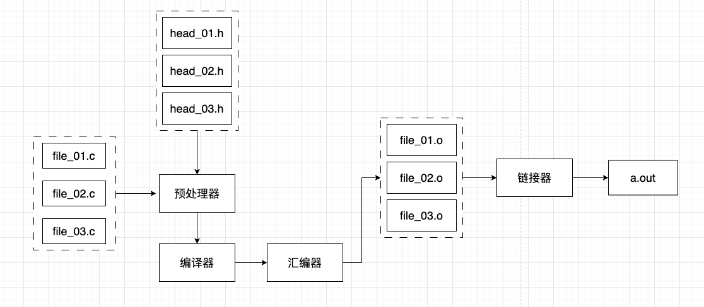

## 生成二进制文件的过程

当我们踏入计算机学习的时候，大多数的同学应该都是从如下一个简单的“hello world”，生成一个 `a.out` 的可执行文件，然后执行他，屏幕上输出一行 “hello world”。

```c
#include <stdio.h>

int main() {
		printf("hello world\n");
		return 0;
}
```

然后进行编译，运行。

```
# 编译 main.c 这个文件，会生成一个 a.out 的文件
gcc main.c
# 执行 a.out，会输出 "hello world"
./a.out
```

那么问题来了，这个文件是如何生成的？中间经历了什么过程？最终生成的文件是如何被运行的？中间又经历了什么过程才会在屏幕上输出 “hello world” 这个字符串呢？

我们本着刨根问底的态度去探究探究。接下来的几篇文章就是为了分享，如何生成二进制，以及二进制长什么样，二进制如何运行等问题。由于这几个问题涉及的技术非常深入，因此我们会有肥有瘦的去分享，对于那些解释的不详细的技术我们再会。

我们环境定位在 Linux 环境下的二进制文件。语言主要涉及：汇编、C语言等。本篇文章我们来研究研究二进制的生成过程。

当我们使用 `gcc main.c` 的时候，实际上 gcc 帮我们完成了多个步骤，分别是：**预处理、编译、汇编、链接** 这四个步骤。如下图：



### 一、预处理过程

首先文字来说预处理做了什么事情，预处理过程主要处理源代码中以 ‘#’ 开始的预处理指令。比如 "#include"、"#define" 等等。如下主要规则：

- 将所有的 "#define" 删除，并且展开所有的宏定义
- 处理所有条件预处理指令，比如：`#if  #ifdef  #ifndef  #elif  #else  #endif` 等
- 处理 "#include" 预处理指令，将被包含的文件插入到该预处理指令的位置，这个过程是递归进行，包含的文件还可能包含其他文件
- 删除所有的注释，比如 `// 和 /* xxx */ `
- 添加行号和文件名标识，以便于编译时编译器产生调试用的行号信息，以及用于编译时产生编译错误或者警告时可以显示行号
- 保留所有的 "#pragma" 编译器指令，因为编译器需要使用它

接下来我们进行查看预处理后，文件内容变成了什么？

```shell
# gcc -E -P main.c

typedef long unsigned int size_t;
typedef unsigned char __u_char;
typedef unsigned short int __u_short;
typedef unsigned int __u_int;
typedef unsigned long int __u_long;
typedef signed char __int8_t;
typedef unsigned char __uint8_t;
typedef signed short int __int16_t;

extern const char *const sys_errlist[];
extern int fileno (FILE *__stream) __attribute__ ((__nothrow__ , __leaf__)) ;
extern int fileno_unlocked (FILE *__stream) __attribute__ ((__nothrow__ , __leaf__)) ;
extern FILE *popen (const char *__command, const char *__modes) ;
extern int pclose (FILE *__stream);
extern char *ctermid (char *__s) __attribute__ ((__nothrow__ , __leaf__));
extern void flockfile (FILE *__stream) __attribute__ ((__nothrow__ , __leaf__));
extern int ftrylockfile (FILE *__stream) __attribute__ ((__nothrow__ , __leaf__)) ;
extern void funlockfile (FILE *__stream) __attribute__ ((__nothrow__ , __leaf__));

int main() {
 printf("hello world\n");
 return 0;
}
```

其中 `-E` 选项表示让 GCC 在预处理后停止；`-P` 选项表示让 GCC 忽略调试信息。

我们会发现原本只有几行代码，展开 `stdio.h` 之后生成了很多代码。当然，会把 `stdio.h` 这个文件的所有内容都包含在内。也就是我们上面看到的，处理了 `#include` 预处理指令等。

### 二、编译过程

预处理阶段完成之后，我们就可以编译源代码了。编译阶段会将代码转换为汇编语言。中间会经过一系列的词法分析、语法分析、语义分析；然后进行优化后生成汇编代码文件。

大多数编译器会在此阶段进行大量优化，通常可以使用 GCC 的 `-O` 选项来指定优化级别，优化级别从 `-O0` 到 `-O3` 依次优化程度越高。

现代的 GCC 一般会把预处理和编译 着两个步骤合并成一个步骤，使用叫做 cc1 的程序来完成这个步骤。这个工具一般的位置为：`/usr/lib/gcc/x86_64-linux-gnu/7.5.0/cc1` 中。我们可以直接调用 cc1 来完成编译过程。

```shell
# /usr/lib/gcc/x86_64-linux-gnu/7.5.0/cc1 main.c
 main
Analyzing compilation unit
Performing interprocedural optimizations
 <*free_lang_data> <visibility> <build_ssa_passes> <opt_local_passes> <targetclone> <free-inline-summary> <whole-program> <inline>Assembling functions:
 <materialize-all-clones> <simdclone> main
Execution times (seconds)
 phase setup             :   0.00 ( 0%) usr   0.00 ( 0%) sys   0.00 ( 0%) wall    1179 kB (68%) ggc
 phase parsing           :   0.00 ( 0%) usr   0.00 ( 0%) sys   0.01 (100%) wall     488 kB (28%) ggc
 preprocessing           :   0.00 ( 0%) usr   0.00 ( 0%) sys   0.01 (100%) wall     152 kB ( 9%) ggc
 TOTAL                 :   0.00             0.00             0.01               1731 kB
```

执行完之后会在当前目录中生成一个 `main.s` 文件。

也可以使用 GCC 的 `-S` 选项来编译，使用 `-masm=intel` 让 GCC 生成的汇编语法风格为 masm 而不是 att 风格。Linux 下默认生成的汇编语言风格为 att 风格。汇编语言的风格可以自行了解，这里不再累赘。

```c
# gcc -S main.c -masm=intel
# cat main.s
	.file	"main.c"
	.intel_syntax noprefix
	.text
	.section	.rodata
.LC0:
	.string	"hello world"
	.text
	.globl	main
	.type	main, @function
main:
.LFB0:
	.cfi_startproc
	push	rbp
	.cfi_def_cfa_offset 16
	.cfi_offset 6, -16
	mov	rbp, rsp
	.cfi_def_cfa_register 6
	lea	rdi, .LC0[rip]
	call	puts@PLT
	mov	eax, 0
	pop	rbp
	.cfi_def_cfa 7, 8
	ret
	.cfi_endproc
.LFE0:
	.size	main, .-main
	.ident	"GCC: (Ubuntu 7.5.0-3ubuntu1~18.04) 7.5.0"
	.section	.note.GNU-stack,"",@progbits
```

如上生成了 `main.s` 汇编代码，这段汇编代码还是很清晰的。如常量和变量拥有符号名称而不仅仅是内存地址，如 “hello world” 的匿名字符串是 LCO。而且把我们的 printf 函数优化为 puts。

**为什么编译过程将代码转换为汇编语言而不是机器代码？**

我们了解了编译的过程后，我们提出了这个问题，貌似直接生成机器代码，直接一步到位。这里只是分享一种解释，现代的项目为了开发效率高，产生了很多高级语言，比如：C++、Java、Go、Python、PHP、Objective-C 等等，对于这些高级语言来说，先进行转换为汇编语言是比较有意义的。因为编写一种能够直接为每种语言翻译机器代码的编译器是一项极其苛刻且耗时的任务，因此最好先将其翻译成汇编代码（这已经是一项非常有挑战的任务了），并且需要一个专用的汇编程序，以处理每种语言的汇编代码到机器代码的转换。

当然还有很多原因，比如历史原因哈哈哈。其他线索可以慢慢探索

### 三、汇编过程

汇编器可以将汇编代码转换成机器代码。相对的，汇编过程是比较简单的，只需要根据汇编指令和机器指令的对照表一一翻译即可。汇编器可以使用 as 来完成

```
# as main.s -o main.o
```

也可以使用 GCC 的 -c 选项

```
# gcc -c main.s -o main.o
```

最终会生成 `main.o` 文件。这个文件被称为目标文件（Object File）。

我们使用 Linux 中的 `file` 工具来查看这个文件

```
# file main.o
main.o: ELF 64-bit LSB relocatable, x86-64, version 1 (SYSV), not stripped
```

简单说一下 file 工具的返回。

- ELF：表示这个文件的格式为 ELF 格式，后面会重点介绍到

- 64-bit：表示他是 64 位的

- LSB：表示最低有效位（Least Significant Bit），这意味着数字在内存中的排序是以最低有效字节优先的

- relocatable：表示这个文件是 “可重定位文件”。可重定位文件不依赖于放置在内存中的任何特定地址，相反，他们可以随意移动，而不会破坏代码中的任何假设。

  文件之间相互独立编译，因此汇编程序在组装文件时无法知道其他文件的内存地址，这也是文件为什么需要可重定位的原因。

  后面会具体介绍到这个文件类型

- x86-64：表示可以在 x86-64 系统上运行

-  version 1 (SYSV)：SYSV 是 System V 的简称，是一个 Unix 操作系统版本。那么 `version 1 (SYSV)` 表示该文件采用了第一个版本的 SYSV 格式。System V 具有多个版本，每个版本都可能有一些不同的规范和特性。

- not stripped：表示该文件没有被裁剪。有些场景会使用 “strip”工具去除裁剪 ELF 文件中的符号表或调试信息，以减小文件大小并保护程序的安全。

### 四、链接过程

整个生成二进制的最后一个过程是链接，这个过程会将所有的文件链接到一个二进制可执行文件中。问题来了

**为什么汇编器不直接生成可执行文件，而是输出一个目标文件呢？**

在前面步骤，我们生成了文件是可重定位的，因为他们是相互独立编译的，这使得编译器无法得知某个对象最终会出现在那个固定的地址上。

```
a.c
extern int val;
val = 20;

b.c
int val = 10;
```

如上，这两个文件中都有一个全局变量 val。其中 a.c 文件中的 val 变量被 extern 修饰了。如果他们一起编译到一个二进制可执行文件中，那么这个全局的 val 变量使用的是同一个。但是对于单独的 a.o 和单独的 a.o 是无法确定这个 val 的地址的。

可重定位文件可以引用其他文件或者程序外部库中的函数或者变量。在链接过程之前，引用代码和数据的地址尚不清楚，因此可重定位文件只包含重定位符号，这些符号指定最终如何解析函数和变量引用。

在链接上下文中，依赖于重定位符号的引用称为符号引用。当一个可重定位文件通过绝对地址引用自己的函数或者变量时，该引用也会被符号化。

链接器的工作是获取术语程序的所有文件，并将他们合并成一个连贯的可执行文件，然后加载到特定的内存地址。

在链接过程中分为动态链接和静态链接。这里先简单介绍一下这两种方式。

- 静态库（Linux 中以 `.a` 为后缀）其实就是可重定位文件（后缀为 `.o`）的打包。并且静态库被合并到二进制可执行文件中，允许完全解析对静态库的任何引用
- 动态库，也称为共享库，他们在系统上运行的所有程序的内存中共享。也就是说，不是将库文件复制到使用它的每个二进制文件中，而是仅将动态库加载到内存一次，并且任何想要使用该库的二进制文件都需要使用此共享副本。

在链接过程中，动态库将驻留的内存地址尚不清楚，因此无法解析对他们的引用。相反，即使在最终的可执行文件中，链接器也会对这些库文件留下符号引用，并且将二进文件实际加载到要执行的内存中之前，不会解析这些引用。

如下我们在来说明一下可重定位文件的链接过程。如下我们使用 `ld` 工具来产生一个可执行文件

```
ld -static  /usr/lib/x86_64-linux-gnu/crt1.o /usr/lib/x86_64-linux-gnu/crti.o /usr/lib/gcc/x86_64-linux-gnu/7/crtbeginT.o -L /usr/lib/x86_64-linux-gnu -L/usr/lib/gcc/x86_64-linux-gnu/7 main.o --start-group -lgcc -lgcc_eh -lc --end-group /usr/lib/gcc/x86_64-linux-gnu/7/crtend.o /usr/lib/x86_64-linux-gnu/crtn.o
```

我的机器上使用的是 GCC 7.5.0 版本。这里的 ld 工具就是链接器，他负责将目标文件转换成可执行文件或者共享库。如上的命令最终会生成 `a.out` 可执行文件。不过这个过程也太麻烦了吧。

当然了，这个 ld 工具也被 GCC 承包了，其实大多数编译器，包括 GCC，在编译过程结束时会自动调用链接器。不需要我们去手动寻找。最后我们来看生成的 `a.out` 可执行文件

```
# file a.out
a.out: ELF 64-bit LSB executable, x86-64, version 1 (GNU/Linux), statically linked, for GNU/Linux 3.2.0, not stripped
```

关于 file 的返回上面已经说过一部分。我们来看这个可执行文件，会发现

- executable：这个文件是个可执行文件
- statically linked：这个文件是被静态链接的。不依赖任何共享库

我们如果使用 GCC 来生成可执行文件

```
# gcc main.c -o main
# file main
main: ELF 64-bit LSB shared object, x86-64, version 1 (SYSV), dynamically linked, interpreter /lib64/ld-linux-x86-64.so.2, for GNU/Linux 3.2.0, BuildID[sha1]=5db59b41c21bae24a33868fdff71cc70020a1f89, not stripped
```

GCC 的 `-o` 选项表示输出文件的名称。我们会发现

- GCC 默认生成的文件是动态链接的（dynamically linked）。这意味着他使用的某些库未合并到可执行文件中，而是在同一系统上运行的所有程序之间共享。
- 还有 `interpreter /lib64/ld-linux-x86-64.so.2` 表示当可执行文件加载内存中执行时，是那个动态链接器将会被用来解析动态库的最终依赖关系。

### 五、小结

至此我们简单介绍了二进制文件的生成过程，但是这四个步骤：预处理、编译、汇编、链接。这其中的细节并没有探究，感兴趣的同学可以深入研究，每一个点都是一个非常有深度的技术专题。